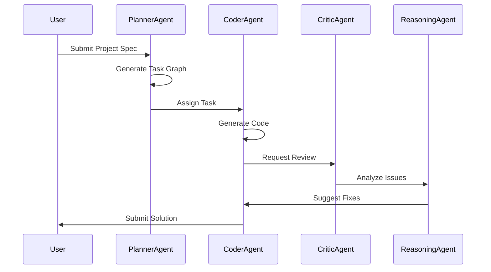
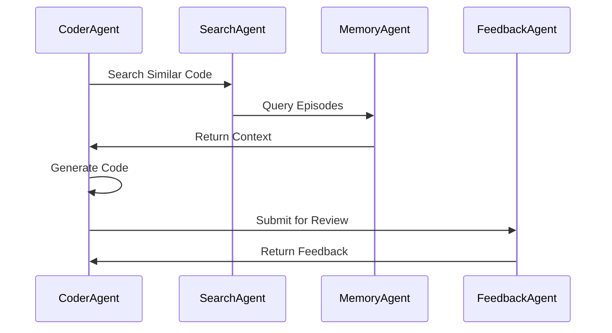
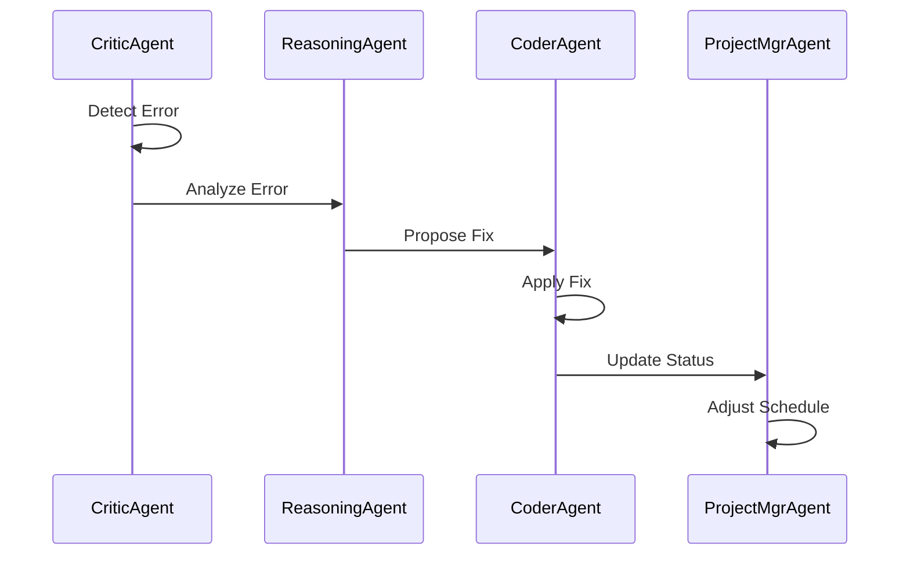

# Agent Architecture & Capabilities

[](https://docs.nootropic.dev)
[](LICENSE)

## Table of Contents

- [Agent Architecture & Capabilities](#agent-architecture--capabilities)
  - [Table of Contents](#table-of-contents)
  - [Overview](#overview)
  - [Core Agents](#core-agents)
  - [Agent Communication](#agent-communication)
  - [Agent Lifecycle](#agent-lifecycle)
  - [Agent Configuration](#agent-configuration)
  - [Agent Interactions](#agent-interactions)
  - [Agent Deployment](#agent-deployment)
  - [Agent Monitoring](#agent-monitoring)
  - [Agent Security](#agent-security)
  - [Agent Testing](#agent-testing)
  - [Agent Troubleshooting](#agent-troubleshooting)

## Overview

nootropic's agent architecture is designed around a set of specialized agents that work together through Temporal workflows and RxJS event streams. Each agent has a specific role and communicates with others through well-defined interfaces.

> **See Also**: [Architecture Overview](../ARCHITECTURE.md#component-interactions) for details on how agents interact within the system.

## Core Agents

### 1. PlannerAgent

**Purpose**: Converts high-level project specifications into actionable task graphs.

**Capabilities**:

- Parses `project-spec.md` into PDDL/HTN format
- Generates DAG of epics, stories, and tasks
- Optimizes task ordering based on dependencies
- Handles delta-replanning when tasks fail

**Interfaces**:

```typescript
interface PlannerAgent {
  generatePlan(spec: ProjectSpec): Promise<TaskGraph>;
  replanSubtree(taskId: string, context: ReplanContext): Promise<TaskGraph>;
  validatePlan(graph: TaskGraph): Promise<ValidationResult>;
}
```

> **See Also**: [Project Planning](../ARCHITECTURE.md#project-planning) for details on the planning process.

### 2. CoderAgent

**Purpose**: Generates and refactors code based on task requirements.

**Capabilities**:

- Code generation from natural language
- AST-safe refactoring
- Multi-file coordination
- Test generation

**Interfaces**:

```typescript
interface CoderAgent {
  generateCode(task: Task, context: CodeContext): Promise<CodeResult>;
  refactorCode(file: string, instructions: string): Promise<RefactorResult>;
  generateTests(file: string, coverage: number): Promise<TestResult>;
}
```

### 3. CriticAgent

**Purpose**: Performs static analysis and test validation.

**Capabilities**:

- Runs Semgrep rules
- Executes unit tests
- Performs security scanning
- Applies automatic fixes

**Interfaces**:

```typescript
interface CriticAgent {
  analyzeCode(code: string): Promise<AnalysisResult>;
  runTests(tests: TestSuite): Promise<TestResult>;
  applyFixes(issues: Issue[]): Promise<FixResult>;
}
```

### 4. ReasoningAgent

**Purpose**: Provides self-reflection and problem-solving capabilities.

**Capabilities**:

- Chain-of-thought reasoning
- Error analysis
- Solution optimization
- Knowledge synthesis

**Interfaces**:

```typescript
interface ReasoningAgent {
  analyzeProblem(problem: Problem): Promise<Analysis>;
  proposeSolution(context: Context): Promise<Solution>;
  validateReasoning(reasoning: Reasoning): Promise<Validation>;
}
```

### 5. MemoryAgent

**Purpose**: Manages episodic memory and knowledge retrieval.

**Capabilities**:

- Stores successful episodes
- Retrieves relevant context
- Manages vector embeddings
- Handles knowledge updates

**Interfaces**:

```typescript
interface MemoryAgent {
  storeEpisode(episode: Episode): Promise<void>;
  retrieveSimilar(query: string, k: number): Promise<Episode[]>;
  updateKnowledge(update: KnowledgeUpdate): Promise<void>;
}
```

### 6. SearchAgent

**Purpose**: Provides semantic search and code navigation.

**Capabilities**:

- Hybrid RAG (dense + sparse)
- Code search
- Documentation search
- Cross-repo navigation

**Interfaces**:

```typescript
interface SearchAgent {
  searchCode(query: string): Promise<SearchResult[]>;
  searchDocs(query: string): Promise<DocResult[]>;
  navigateSymbol(symbol: string): Promise<Location>;
}
```

### 7. FeedbackAgent

**Purpose**: Collects and processes user feedback.

**Capabilities**:

- Collects user ratings
- Manages feedback loops
- Triggers LoRA training
- Updates model preferences

**Interfaces**:

```typescript
interface FeedbackAgent {
  collectFeedback(feedback: Feedback): Promise<void>;
  scheduleTraining(data: TrainingData): Promise<void>;
  updatePreferences(prefs: Preferences): Promise<void>;
}
```

### 8. ProjectMgrAgent

**Purpose**: Manages project lifecycle and coordination.

**Capabilities**:

- Task scheduling
- Resource allocation
- Progress tracking
- SLA monitoring

**Interfaces**:

```typescript
interface ProjectMgrAgent {
  scheduleTask(task: Task): Promise<Schedule>;
  allocateResources(request: ResourceRequest): Promise<Allocation>;
  trackProgress(project: Project): Promise<Progress>;
}
```

## Agent Communication

### 1. Temporal Workflows

Each agent participates in Temporal workflows that ensure durability and consistency:

```typescript
interface AgentWorkflow {
  executeTask(task: Task): Promise<Result>;
  handleError(error: Error): Promise<Resolution>;
  coordinateWith(other: Agent): Promise<void>;
}
```

> **See Also**: [Workflow Engine](../ARCHITECTURE.md#workflow-engine) for details on the workflow system.

### 2. Event Streams

Agents communicate through RxJS event streams:

```typescript
interface AgentEvents {
  taskStarted: Observable<TaskEvent>;
  taskCompleted: Observable<CompletionEvent>;
  errorOccurred: Observable<ErrorEvent>;
  feedbackReceived: Observable<FeedbackEvent>;
}
```

## Agent Lifecycle

### 1. Initialization

```typescript
interface AgentInitialization {
  loadConfig(): Promise<Config>;
  connectDependencies(): Promise<void>;
  validateState(): Promise<ValidationResult>;
}
```

### 2. Operation

```typescript
interface AgentOperation {
  start(): Promise<void>;
  pause(): Promise<void>;
  resume(): Promise<void>;
  stop(): Promise<void>;
}
```

### 3. Monitoring

```typescript
interface AgentMonitoring {
  getMetrics(): Promise<Metrics>;
  getHealth(): Promise<Health>;
  getStatus(): Promise<Status>;
}
```

## Agent Configuration

### 1. Base Configuration

```yaml
agent:
  name: string
  version: string
  capabilities: string[]
  dependencies: string[]
  config:
    timeout: number
    retries: number
    backoff: string
```

### 2. Model Configuration

```yaml
model:
  provider: string
  model: string
  parameters:
    temperature: number
    max_tokens: number
    top_p: number
```

### 3. Resource Configuration

```yaml
resources:
  cpu: number
  memory: string
  gpu: boolean
  storage: string
```

## Agent Interactions

### 1. Task Planning Flow



### 2. Code Generation Flow



### 3. Error Handling Flow



## Agent Deployment

### 1. Container Configuration

```yaml
# docker-compose.yml
version: "3.8"

services:
  planner-agent:
    image: nootropic/planner-agent:latest
    environment:
      - NODE_ENV=production
      - TEMPORAL_HOST=temporal:7233
      - REDIS_HOST=redis:6379
    volumes:
      - ./config:/app/config
    depends_on:
      - temporal
      - redis

  coder-agent:
    image: nootropic/coder-agent:latest
    environment:
      - NODE_ENV=production
      - MODEL_PATH=/models
      - VECTOR_STORE=chroma
    volumes:
      - ./models:/models
      - ./config:/app/config
    depends_on:
      - planner-agent
      - chroma

  critic-agent:
    image: nootropic/critic-agent:latest
    environment:
      - NODE_ENV=production
      - SEMGREP_RULES=/rules
      - TEST_REPORTS=/reports
    volumes:
      - ./rules:/rules
      - ./reports:/reports
    depends_on:
      - coder-agent
```

### 2. Kubernetes Deployment

```yaml
# k8s/agents.yaml
apiVersion: apps/v1
kind: Deployment
metadata:
  name: planner-agent
spec:
  replicas: 3
  selector:
    matchLabels:
      app: planner-agent
  template:
    metadata:
      labels:
        app: planner-agent
    spec:
      containers:
        - name: planner-agent
          image: nootropic/planner-agent:latest
          resources:
            requests:
              memory: "1Gi"
              cpu: "500m"
            limits:
              memory: "2Gi"
              cpu: "1000m"
          env:
            - name: NODE_ENV
              value: "production"
            - name: TEMPORAL_HOST
              value: "temporal:7233"
          volumeMounts:
            - name: config
              mountPath: /app/config
      volumes:
        - name: config
          configMap:
            name: agent-config
```

### 3. Resource Management

```yaml
# config/resources.yaml
resources:
  planner-agent:
    cpu:
      request: 500m
      limit: 1000m
    memory:
      request: 1Gi
      limit: 2Gi
    gpu:
      request: 0
      limit: 0

  coder-agent:
    cpu:
      request: 1000m
      limit: 2000m
    memory:
      request: 2Gi
      limit: 4Gi
    gpu:
      request: 1
      limit: 1

  critic-agent:
    cpu:
      request: 500m
      limit: 1000m
    memory:
      request: 1Gi
      limit: 2Gi
    gpu:
      request: 0
      limit: 0
```

## Agent Monitoring

### 1. Metrics Collection

```typescript
interface AgentMetrics {
  // Performance metrics
  taskLatency: Histogram;
  memoryUsage: Gauge;
  cpuUsage: Gauge;
  gpuUsage: Gauge;

  // Quality metrics
  successRate: Counter;
  errorRate: Counter;
  fixRate: Counter;

  // Resource metrics
  modelLoad: Gauge;
  cacheHitRate: Gauge;
  queueLength: Gauge;
}
```

### 2. Health Checks

```typescript
interface AgentHealth {
  // System health
  status: "healthy" | "degraded" | "unhealthy";
  uptime: number;
  lastHeartbeat: Date;

  // Dependency health
  temporal: HealthStatus;
  redis: HealthStatus;
  model: HealthStatus;
  vectorStore: HealthStatus;

  // Resource health
  memory: ResourceHealth;
  cpu: ResourceHealth;
  gpu: ResourceHealth;
}
```

### 3. Alerting Rules

```yaml
# config/alerts.yaml
alerts:
  - name: high_error_rate
    condition: error_rate > 0.1
    duration: 5m
    severity: critical
    labels:
      component: agent
      type: error

  - name: high_latency
    condition: task_latency > 1s
    duration: 5m
    severity: warning
    labels:
      component: agent
      type: performance

  - name: resource_exhaustion
    condition: memory_usage > 90%
    duration: 1m
    severity: critical
    labels:
      component: agent
      type: resource
```

## Agent Security

### 1. Authentication & Authorization

Agents implement role-based access control and secure communication:

```typescript
interface AgentSecurity {
  // API authentication
  apiKey: string;
  jwtToken: string;
  oauth2: OAuth2Config;

  // Model authentication
  modelKey: string;
  modelToken: string;

  // Service authentication
  serviceAccount: string;
  serviceToken: string;
}
```

> **See Also**: [Security Overview](../SECURITY.md#agent-security) for comprehensive security guidelines.

## Agent Testing

### 1. Unit Tests

```typescript
describe("PlannerAgent", () => {
  it("should generate valid task graph", async () => {
    const agent = new PlannerAgent();
    const spec = loadTestSpec();
    const graph = await agent.generatePlan(spec);
    expect(graph).toBeValid();
  });

  it("should handle replanning", async () => {
    const agent = new PlannerAgent();
    const context = createTestContext();
    const newGraph = await agent.replanSubtree("task-1", context);
    expect(newGraph).toBeValid();
  });
});
```

### 2. Integration Tests

```typescript
describe("Agent Integration", () => {
  it("should complete full workflow", async () => {
    const planner = new PlannerAgent();
    const coder = new CoderAgent();
    const critic = new CriticAgent();

    const spec = loadTestSpec();
    const graph = await planner.generatePlan(spec);
    const task = graph.getNextTask();

    const code = await coder.generateCode(task);
    const review = await critic.analyzeCode(code);

    expect(review.issues).toHaveLength(0);
  });
});
```

### 3. Performance Tests

```typescript
describe("Agent Performance", () => {
  it("should handle concurrent tasks", async () => {
    const agent = new CoderAgent();
    const tasks = generateTestTasks(100);

    const start = Date.now();
    const results = await Promise.all(
      tasks.map((task) => agent.generateCode(task)),
    );
    const duration = Date.now() - start;

    expect(duration).toBeLessThan(60000); // 1 minute
    expect(results).toHaveLength(100);
  });
});
```

## Agent Troubleshooting

### 1. Common Issues

#### High Latency

```bash
# Check system resources
nootropic agent metrics --agent planner-agent

# Check task queue
nootropic agent queue --agent planner-agent

# Check model loading
nootropic agent model --agent coder-agent
```

#### Memory Issues

```bash
# Check memory usage
nootropic agent memory --agent critic-agent

# Check garbage collection
nootropic agent gc --agent critic-agent

# Check memory leaks
nootropic agent profile --agent critic-agent
```

#### Model Issues

```bash
# Check model status
nootropic agent model --status

# Check model performance
nootropic agent model --performance

# Check model errors
nootropic agent model --errors
```

### 2. Debugging Tools

```typescript
interface AgentDebug {
  // Logging
  logLevel: "debug" | "info" | "warn" | "error";
  logFormat: "json" | "text";
  logOutput: "file" | "console" | "syslog";

  // Tracing
  traceEnabled: boolean;
  traceSampling: number;
  traceExport: "jaeger" | "zipkin" | "otlp";

  // Profiling
  profileEnabled: boolean;
  profileInterval: number;
  profileOutput: string;
}
```

### 3. Recovery Procedures

```bash
# Restart agent
nootropic agent restart --agent planner-agent

# Reset agent state
nootropic agent reset --agent coder-agent

# Recover from failure
nootropic agent recover --agent critic-agent
```

---

For more information, see:

- [Architecture Documentation](ARCHITECTURE.md)
- [Deployment Guide](DEPLOYMENT.md)
- [Operations Guide](OPERATIONS.md)
- [Security Guidelines](SECURITY.md)
