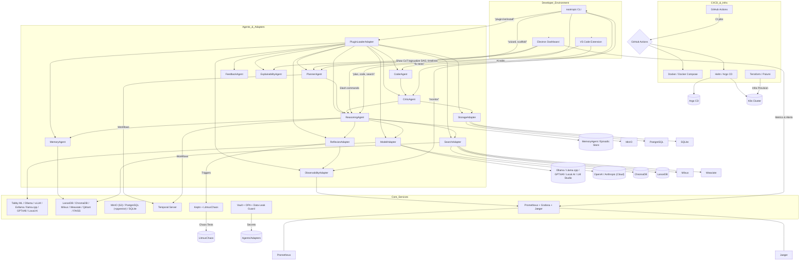

# Design

## Summary

This design document captures the blueprint for nootropic, an AI-driven, open-source developer toolset combining a CLI, VS Code extension, and Electron dashboard with a modular agent/adaptor architecture. It describes how user intents (“plan”, “code”, “search”) flow through ReasoningAgent, CoderAgent, CriticAgent, and other components, leveraging local-first LLM inference (Tabby ML, Ollama, vLLM, Exllama, llama.cpp, GPT4All, Local.AI) and vector-based retrieval (LanceDB, ChromaDB, Milvus, Weaviate, Qdrant, FAISS). Temporal orchestrates long-running workflows (planning, LoRA fine-tuning), while Keptn + LitmusChaos provide self-healing remediation. Observability is built with OpenTelemetry → Prometheus → Grafana/Jaeger, and security/compliance uses Sigstore, SLSA, Semgrep, Trivy, Snyk, Vault, and OPA. The document details subsystem interactions, data models, interfaces, and non-functional considerations (scalability, performance, privacy, maintainability), ensuring alignment with project goals and preventing drift.       

⸻

1. Introduction and Overview

The Introduction sets the context for nootropic’s design, explaining its objectives, scope, and intended audience.  

1.1 Purpose

The purpose of this document is to provide a clear, detailed blueprint for implementing nootropic’s architecture, including components, interfaces, data flows, and non-functional requirements.  

1.2 Scope

This document covers:
• High-level system architecture (CLI, VS Code extension, Electron UI, agents/adapters, core services, CI/CD).
• Component designs (ReasoningAgent, CoderAgent, CriticAgent, PlannerAgent, MemoryAgent, FeedbackAgent, ExplainabilityAgent, ModelAdapter, SearchAdapter, StorageAdapter, ObservabilityAdapter, ReflexionAdapter, PluginLoaderAdapter).
• Data models and flows (RAG retrieval, episodic memory, chain-of-thought prompting).
• Interfaces (CLI commands, LSP slash commands, RESTful endpoints for inference and embeddings).
• Orchestration workflows (Temporal, Keptn + LitmusChaos).
• Non-functional requirements (performance, scalability, privacy, extensibility, maintainability, security, compliance).   

1.3 Audience

This document is intended for:
• Core and contributing developers implementing nootropic’s agents and adapters.
• DevOps engineers deploying services (Kubernetes, Helm, Argo CD).
• QA and security teams validating compliance and performance.
• Technical stakeholders evaluating architecture and design tradeoffs.  

1.4 Definitions, Acronyms, and Abbreviations
• LLM: Large Language Model (e.g., StarCoder, CodeLlama, Llama 2).
• RAG: Retrieval-Augmented Generation.
• CoT: Chain-of-Thought.
• OTEL: OpenTelemetry.
• SLO: Service Level Objective.
• LoRA: Low-Rank Adaptation (fine-tuning method).
• CI/CD: Continuous Integration / Continuous Deployment.
• OPA: Open Policy Agent.
• SLAs: Service Level Agreements.
• SLSA: Supply-chain Levels for Software Artifacts.
• Sigstore: Transparency log for signing and verifying artifacts. 

⸻

2. System Architecture

This section describes the overall structure, including high-level components and their relationships.

2.1 High-Level Components



Explanation:
• Developer Environment: The CLI, VS Code extension (Continue-based), and Electron UI to expose agent functionality.
• Agents & Adapters: TypeScript-based modules implementing planning, reasoning, coding, critique, memory, search, storage, observability, and dynamic plugin loading.
• Core Services: Local-first LLM inference (Tabby ML, Ollama, vLLM, Exllama, llama.cpp, GPT4All, Local.AI), vector stores (LanceDB, ChromaDB, Milvus, Weaviate, Qdrant, FAISS), object/relational stores (MinIO, PostgreSQL+pgvector, SQLite), Temporal for workflow orchestration, Keptn + LitmusChaos for remediation, and OpenTelemetry → Prometheus → Grafana/Jaeger for observability, along with Vault + OPA for secrets and policy enforcement.
• CI/CD & Infra: GitHub Actions runs lint/test/build/security, Docker for containerization, Helm + Argo CD for GitOps, and Terraform/Pulumi to provision cloud resources.     

⸻

2.2 Deployment Architecture

```mermaid
flowchart LR
  subgraph Development
    DevLaptop(["Developer Laptop"])
    DevMonitor(["Local Grafana"])
  end

  subgraph GitHub
    Repo((“nootropic Repo”))
    CI[“GitHub Actions”]
  end

  subgraph Docker Registry
    ImageRepo[(“ghcr.io/nootropic/*”)]
  end

  subgraph Kubernetes Cluster
    HelmRelease[“Argo CD Application”]
    Namespace[“nootropic-namespace”]
    ConfigMaps[“ConfigMaps (Zod-validated)”]
    Secrets[“Vault & SOPS Secrets”]
    Subgraph Services
      ModSvc[“model-adapter”]
      SearchSvc[“search-adapter”]
      StoreSvc[“storage-adapter”]
      AgentWorkers["agent-workers (Temporal, Reasoning, Critic)"]
      GrafanaPod[“Grafana”]
      PromPod[“Prometheus”]
      JaegerPod[“Jaeger”]
      KeptnSvc[“Keptn”]
    end
  end

  DevLaptop -->|Push Code| Repo
  CI -->|Build & Publish Images| ImageRepo
  ImageRepo -->|Helm Pull| HelmRelease
  HelmRelease --> Namespace
  ConfigMaps --> Services
  Secrets --> Services
  Namespace --> Services
  DevMonitor <-- GrafanaPod
  PromPod --> GrafanaPod
  JaegerPod --> GrafanaPod
  KeptnSvc --> AgentWorkers
  Services --> PromPod
  Services --> JaegerPod
```

Explanation:
• Developers push code to GitHub, triggering GitHub Actions to run CI/CD.
• CI builds Docker images and pushes to GitHub Container Registry (ghcr.io/nootropic/\*).
• Argo CD, listening on Helm charts, synchronizes and deploys new versions to a Kubernetes cluster.
• ConfigMaps hold Zod-validated configuration; secrets come from Vault (injected via SOPS + CSI) and OPA policies.
• Services include: model-adapter, search-adapter, storage-adapter, and agent-workers that run Temporal workers, ReasoningAgent, CriticAgent, etc.
• Prometheus scrapes metrics; Grafana and Jaeger visualize performance and traces.
• Keptn monitors SLOs (e.g., inference latency, test failure rates) and triggers chaos experiments via LitmusChaos.    

⸻

3. Component Design

This section details each major component’s responsibilities, interfaces, and data models.

3.1 ReasoningAgent

3.1.1 Responsibilities
• Interpret user intent (from CLI or VS Code slash commands) and generate chain-of-thought (CoT) prompts.
• Retrieve context from MemoryAgent (few-shot examples) and SearchAdapter (RAG retrieval).
• Invoke LLM via ModelAdapter to propose code or plan solutions.
• Emit events (reasoning.start, reasoning.result, reasoning.escalation) via ReflexionAdapter.
• Collaborate with CriticAgent to refine outputs.  

3.1.2 Interfaces

// reasoning-agent/src/index.ts
export interface ReasoningAgentInputs {
taskId: string;
prompt: string;
contextId?: string;
}

export interface ReasoningAgentOutputs {
generatedCode?: string;
suggestedPlan?: TaskGraph;
confidenceScore: number;
}

export class ReasoningAgent {
constructor(config: ReasoningConfig) { … }
public async proposeSolution(
inputs: ReasoningAgentInputs
): Promise<ReasoningAgentOutputs> { … }
public describe(): Capability\[] { … }
}

• proposeSolution: Asynchronously returns generated code or plan along with a confidence score.
• describe(): Returns metadata (commands, inputs, outputs, version) for plugin registry.  

3.1.3 Internal Data Flow

flowchart LR
InputPrompt(("User Task Description"))
Embedding(("Embed Prompt"))
MemoryLookup(("MemoryAgent.retrieveSimilar()"))
RAGQuery(("SearchAdapter.query()"))
CoTPrompt(("Compose Chain-of-Thought Prompt"))
LLMCall(("ModelAdapter.generateCompletion()"))
LLMResponse(("Generated Code / Plan"))
CriticInvite(("Send to CriticAgent for review"))
EventEmit(("ReflexionAdapter.emit events"))

InputPrompt --> Embedding
Embedding --> MemoryLookup
InputPrompt --> RAGQuery
MemoryLookup --> CoTPrompt
RAGQuery --> CoTPrompt
CoTPrompt --> LLMCall
LLMCall --> LLMResponse
LLMResponse --> CriticInvite
LLMResponse --> EventEmit

• Embed Prompt: Converts the user’s description into an embedding.
• MemoryLookup: Retrieves relevant past interactions via MemoryAgent.
• RAGQuery: Retrieves relevant code/docs via SearchAdapter (Chroma, Lance, etc.).
• CoTPrompt: Merges few-shot examples + retrieved context into a CoT prompt template.
• LLMCall: Invokes ModelAdapter, which routes to the most appropriate local or cloud LLM.
• Generated Code/Plan: Passed to CriticAgent for static analysis, and events emitted for ExplainabilityAgent. 

⸻

3.2 CoderAgent

3.2.1 Responsibilities
• Parse LLM-generated diffs using diff2html or js-diff.
• Apply patches programmatically via SimpleGit (git apply).
• Run tests (Vitest, pytest, JUnit) to validate code changes.
• Rollback or prompt for manual intervention if tests fail.  

3.2.2 Interfaces

// coder-agent/src/index.ts
export interface CoderAgentInputs {
repoPath: string;
diffText: string; // unified diff
}

export interface CoderAgentOutputs {
success: boolean;
appliedFiles: string\[];
testResults?: TestReport;
}

export class CoderAgent {
constructor(config: CoderConfig) { … }
public async applyPatch(
inputs: CoderAgentInputs
): Promise<CoderAgentOutputs> { … }
public describe(): Capability\[] { … }
}

• applyPatch: Returns success/failure, list of modified files, and optional test results.
• describe(): Supplies metadata for plugin loader.  

3.2.3 Patch Application Flow

flowchart LR
DiffText(("Unified Diff"))
ParseDiff(("diff2html parsing"))
CheckApply(("git apply --check"))
ApplyPatch(("git apply"))
RunTests(("Run Vitest / pytest / JUnit"))
TestOutcomes(("Pass / Fail"))
Rollback(("git reset --hard" if fail))

DiffText --> ParseDiff
ParseDiff --> CheckApply
CheckApply -->|Valid| ApplyPatch
ApplyPatch --> RunTests
RunTests --> TestOutcomes
TestOutcomes -->|Fail| Rollback
TestOutcomes -->|Pass| End(("done"))

• git apply –check: Verifies that the diff can be applied cleanly.
• git apply: Applies the diff to the working directory.
• RunTests: Executes the project’s test suite; if any failure, trigger rollback.  

⸻

3.3 CriticAgent

3.3.1 Responsibilities
• Perform static analysis using Semgrep (v1.30+) with AI-powered autofix rules.
• Invoke OpenRewrite (v8.x) to automatically refactor anti-patterns (e.g., N+1 SQL queries).
• Generate suggestions or patches for security and style improvements.
• Provide confidence scores for each suggestion.  

3.3.2 Interfaces

// critic-agent/src/index.ts
export interface CriticAgentInputs {
repoPath: string;
targetFiles: string\[];
}

export interface CriticAgentOutputs {
issuesFound: Issue\[];
autofixPatches: string\[]; // unified diffs
confidenceScores: Record\<string, number>;
}

export class CriticAgent {
constructor(config: CriticConfig) { … }
public async analyze(
inputs: CriticAgentInputs
): Promise<CriticAgentOutputs> { … }
public describe(): Capability\[] { … }
}

• analyze: Returns list of issues, autofix patches, and per-file confidence.
• describe(): Registers the agent for plugin discovery.  

3.3.3 Static Analysis Flow

flowchart LR
SourceFiles(("Modified / New Files"))
SemgrepScan(("run semgrep --config ai‐autofix"))
SemgrepResults(("Issues + Autofix Diffs"))
OpenRewriteRun(("openrewrite CLI on repo"))
ORResults(("Refactor Diffs"))
MergePatches(("Merge semgrep & openrewrite patches"))
ProvideFeedback(("Return to FeedbackAgent / CoderAgent"))

SourceFiles --> SemgrepScan
SemgrepScan --> SemgrepResults
SemgrepResults --> MergePatches
OpenRewriteRun --> ORResults
ORResults --> MergePatches
MergePatches --> ProvideFeedback

• Semgrep: Runs policy-based scans (security, best practices) and optionally auto-patches common issues.
• OpenRewrite: Applies advanced AST-based refactors across multiple languages.
• MergePatches: Consolidates autofix patches into a single diff for CoderAgent to apply.  

⸻

3.4 PlannerAgent

3.4.1 Responsibilities
• Parse project-spec.yaml (js-yaml v4+) to extract project goals, tasks, and dependencies.
• Generate PDDL domain/problem files using custom templates.
• Invoke Fast-Downward (v23.02) to compute task dependency graph (DAG).
• Convert DAG into JSON (graphlib or dagre format) for visualization.
• Publish plan via ReflexionAdapter events.  

3.4.2 Interfaces

// planner-agent/src/index.ts
export interface PlannerAgentInputs {
specPath: string; // path to project-spec.yaml
}

export interface PlannerAgentOutputs {
taskGraph: TaskGraph; // DAG representation
}

export class PlannerAgent {
constructor(config: PlannerConfig) { … }
public async generatePlan(
inputs: PlannerAgentInputs
): Promise<PlannerAgentOutputs> { … }
public describe(): Capability\[] { … }
}

• generatePlan: Produces a TaskGraph object containing nodes (tasks) and edges (dependencies).
• describe(): Returns agent capabilities for the central registry.  

3.4.3 Planning Flow

flowchart LR
LoadSpec(("Read project-spec.yaml"))
ParseYAML(("js-yaml.parse()"))
PDDLGen(("Generate PDDL domain & problem"))
FastDownward(("Run Fast-Downward"))
GetPlan(("Extract TaskGraph from output"))
ConvertJSON(("graphlib/Dagre format"))
EmitPlan(("ReflexionAdapter.emit plan"))
Dashboard(("Electron TimelineView"))

LoadSpec --> ParseYAML
ParseYAML --> PDDLGen
PDDLGen --> FastDownward
FastDownward --> GetPlan
GetPlan --> ConvertJSON
ConvertJSON --> EmitPlan
EmitPlan --> Dashboard

• js-yaml: Parses YAML into JavaScript objects.
• PDDLGen: Renders domain/problem using templates (mustache/EJS).
• Fast-Downward: Produces optimal plan using heuristics (LMAX, FF).
• graphlib/Dagre: Transforms plan into a DAG data structure for visualization.  

⸻

3.5 MemoryAgent

3.5.1 Responsibilities
• Store episodes: (prompt, response, feedback, timestamp) in ChromaDB (v0.4+).
• Retrieve few-shot examples: Based on semantic similarity (kNN) to current prompt.
• Fallback to LanceDB: When ChromaDB dataset exceeds threshold (1M vectors).
• Provide indexing and compaction: Automatic maintenance of on-disk storage. 

3.5.2 Interfaces

// memory-agent/src/index.ts
export interface MemoryAgentInputs {
promptEmbedding: number\[]; // vector representation
k: number; // number of few-shot examples
}

export interface MemoryAgentOutputs {
episodes: Episode\[]; // {prompt, response, feedback, timestamp}
}

export class MemoryAgent {
constructor(config: MemoryConfig) { … }
public async retrieveSimilar(
inputs: MemoryAgentInputs
): Promise<MemoryAgentOutputs> { … }
public async storeEpisode(
episode: Episode
): Promise<void> { … }
public describe(): Capability\[] { … }
}

• retrieveSimilar: Returns top-k episodes by vector similarity.
• storeEpisode: Embeds the episode and upserts into ChromaDB; triggers compaction if needed. 

3.5.3 Episodic Flow

flowchart LR
Episode(("Prompt + Response + Feedback"))
EmbedEpisode(("Embed using Local.AI or Tabby"))
Upsert(("VectorStoreAdapter.upsert() into ChromaDB"))
CheckSize(("If >1M vectors"))
Fallback(("Migrate older embeddings to LanceDB"))
Query(("Incoming prompt embedding"))
QueryVec(("VectorStoreAdapter.query()"))
ReturnExamples(("Return top-k episodes"))

Episode --> EmbedEpisode
EmbedEpisode --> Upsert
Upsert --> CheckSize
CheckSize -->|Yes| Fallback
CheckSize -->|No| End
Query --> QueryVec
QueryVec --> ReturnExamples

• EmbedEpisode: Converts episode content into a vector.
• VectorStoreAdapter: Abstracts ChromaDB and LanceDB; performs upserts and queries. 

⸻

3.6 SearchAdapter

3.6.1 Responsibilities
• Index code and documentation: Into ChromaDB for semantic search, and optionally Elasticsearch for full-text queries.
• Perform RAG retrieval: Given a query, return top-k relevant fragments (code, docs).
• Fallback logic: If Chroma recall < threshold, switch to Weaviate or Milvus for hybrid/large-scale retrieval.  

3.6.2 Interfaces

// search-adapter/src/index.ts
export interface SearchAdapterInputs {
queryText: string;
namespace: string;
k: number;
}

export interface SearchAdapterOutputs {
results: SearchResult\[]; // {id, snippet, metadata, score}
}

export class SearchAdapter {
constructor(config: SearchConfig) { … }
public async query(
inputs: SearchAdapterInputs
): Promise<SearchAdapterOutputs> { … }
public async indexDocument(
doc: Document
): Promise<void> { … }
public describe(): Capability\[] { … }
}

• query: Embeds queryText, calls ChromaDB or fallback store, returns results.
• indexDocument: Upserts document embeddings and stores original text in metadata. 

3.6.3 Retrieval Flow

flowchart LR
QueryText(("User Query"))
EmbedQuery(("Embed Query Text"))
ChromaQuery(("ChromaDB.knnSearch()"))
CheckRecall(("If recall < threshold"))
FallbackWeaviate(("Weaviate.query()"))
FallbackMilvus(("Milvus.query()"))
ReturnResults(("Return Top-k Fragments"))

QueryText --> EmbedQuery
EmbedQuery --> ChromaQuery
ChromaQuery --> CheckRecall
CheckRecall -->|Yes| FallbackWeaviate
CheckRecall -->|Yes| FallbackMilvus
CheckRecall -->|No| ReturnResults
FallbackWeaviate --> ReturnResults
FallbackMilvus --> ReturnResults

• EmbedQuery: Converts query text into embedding.
• ChromaQuery: Primary retrieval on local ChromaDB.
• Fallback: Use Weaviate or Milvus for larger corpora or advanced filtering. 

⸻

3.7 ModelAdapter

3.7.1 Responsibilities
• Abstract LLM backends: Tabby ML, Ollama, vLLM, Exllama, llama.cpp, GPT4All, Local.AI, and cloud APIs (OpenAI, Anthropic).
• Implement ModelRegistry: Zod-validated JSON schema that defines available models, backends, and routing policies.
• Perform hybrid routing: Choose local backend when possible; otherwise, fall back to cloud with cost/latency constraints.
• Handle quantization: Integrate AutoGPTQ pipelines for 4-bit/8-bit model optimization.  

3.7.2 Interfaces

// model-adapter/src/index.ts
export interface ModelAdapterInputs {
prompt: string;
modelAlias: string; // e.g., "starcoder2-7b"
maxTokens: number;
}

export interface ModelAdapterOutputs {
text: string;
usage: {
promptTokens: number;
completionTokens: number;
totalTokens: number;
};
}

export class ModelAdapter {
constructor(config: ModelAdapterConfig) { … }
public async generateCompletion(
inputs: ModelAdapterInputs
): Promise<ModelAdapterOutputs> { … }
public describe(): Capability\[] { … }
}

• generateCompletion: Returns generated text, token usage, and backend metadata.
• describe(): Exposes adapter’s capabilities for plugin discovery. 

3.7.3 Routing Logic

flowchart LR
CheckConfig(("Read ~/.nootropic/config.json (Zod Validate)"))
PreferredModel(("User selects or default local model"))
CheckHardware(("Check GPU/CPU availability"))
RouteLocal(("Local backend (Tabby/Ollama/vLLM/Exllama/llama.cpp/Local.AI)"))
RouteQuant(("AutoGPTQ quantization if needed"))
CheckLatencyCost(("Latency or cost exceed thresholds?"))
RouteCloud(("OpenAI / Anthropic fallback"))
ReturnCompletion(("Return text + usage"))

CheckConfig --> PreferredModel
PreferredModel --> CheckHardware
CheckHardware -->|Sufficient| RouteLocal
CheckHardware -->|Insufficient| RouteCloud
RouteLocal --> CheckLatencyCost
CheckLatencyCost -->|OK| ReturnCompletion
CheckLatencyCost -->|Exceed| RouteCloud
RouteCloud --> ReturnCompletion

• CheckConfig: Reads and validates user config.
• PreferredModel: Chooses alias from config (e.g., starcoder2-7b-4bit).
• CheckHardware: Verifies GPU memory and CPU availability.
• Local Routing: Selects best local runtime (Tabby ML for larger GPUs, Ollama or llama.cpp for smaller).
• Quantization: Optionally run AutoGPTQ to optimize models before inference.
• Cloud Fallback: If local inference is too slow or expensive, route to OpenAI/Anthropic.  

⸻

3.8 StorageAdapter

3.8.1 Responsibilities
• Interact with object storage: MinIO (S3-compatible) for storing artifacts, logs, and user-uploaded files.
• Manage relational metadata: PostgreSQL (with pgvector) for structured data (task definitions, plugin manifests, user profiles).
• Support local dev: SQLite for small-scale metadata and local fallback.
• Provide a unified API: For CRUD operations on binary blobs and metadata.  

3.8.2 Interfaces

// storage-adapter/src/index.ts
export interface StorageAdapterInputs {
bucket: string;
key: string;
content?: Buffer;
metadata?: Record\<string, any>;
}

export interface StorageAdapterOutputs {
url?: string;
data?: Buffer;
}

export class StorageAdapter {
constructor(config: StorageConfig) { … }
public async upload(
inputs: StorageAdapterInputs
): Promise<StorageAdapterOutputs> { … }
public async download(
inputs: StorageAdapterInputs
): Promise<StorageAdapterOutputs> { … }
public async delete(
inputs: StorageAdapterInputs
): Promise<void> { … }
public describe(): Capability\[] { … }
}

• upload: Puts a binary blob into MinIO or PostgreSQL (as bytea).
• download: Retrieves a blob by key from the chosen backend.
• delete: Removes an object or record.  

3.8.3 Storage Flow

flowchart LR
UploadRequest(("upload(bucket, key, content)"))
ChooseBackend(("Check config: MinIO vs PostgreSQL vs SQLite"))
IfMinIO(("PutObject to S3 bucket"))
IfPostgres(("INSERT into file\_table"))
IfSQLite(("INSERT into sqlite\_blob\_table"))
ReturnURL(("Return presigned URL or local file path"))

downloadRequest(("download(bucket, key)"))
CheckBackend(("Select same backend used for upload"))
FetchBlob(("GETObject or SELECT bytea"))
ReturnData(("Return Buffer"))

deleteRequest(("delete(bucket, key)"))
CheckBackend2(("Select backend"))
DeleteBlob(("Delete from S3 or DB"))
Confirm(("Return ack"))

• ChooseBackend: Based on environment (local dev vs staging vs prod), route to appropriate store.
• MinIO: S3 API calls for large binaries.
• PostgreSQL: Bytea for smaller artifacts.
• SQLite: Local dev fallback for quick prototypes.  

⸻

3.9 ObservabilityAdapter

3.9.1 Responsibilities
• Instrument code: Using OpenTelemetry (v1.20+), creating spans and metrics for agents and adapters.
• Export metrics: To Prometheus (v2.50+) and traces to Jaeger (v1.41+).
• Provide an API: For other components to record custom metrics (e.g., reasoning.latency\_ms, vector.query.latency), logs (via Pino/Winston integration), and events (via ReflexionAdapter).
• Serve as Grafana data source: For dashboards visualizing system health, event bus depth, and model performance. 

3.9.2 Interfaces

// observability-adapter/src/index.ts
export interface ObservabilityAdapterInputs {
spanName: string;
attributes?: Record\<string, any>;
}

export interface ObservabilityAdapterOutputs {
spanId: string;
metricsAck: boolean;
}

export class ObservabilityAdapter {
constructor(config: ObservabilityConfig) { … }
public startSpan(
inputs: ObservabilityAdapterInputs
): Promise<ObservabilityAdapterOutputs> { … }
public endSpan(spanId: string): Promise<void> { … }
public recordMetric(
metricName: string,
value: number,
labels?: Record\<string, string>
): Promise<void> { … }
public describe(): Capability\[] { … }
}

• startSpan / endSpan: Manages OTEL spans.
• recordMetric: Emits Prometheus metrics using OTEL exporters.
• describe(): Registers adapter’s capabilities. 

3.9.3 Instrumentation Flow

flowchart LR
Component(("Any Component (e.g., ModelAdapter)"))
StartSpan(("ObservabilityAdapter.startSpan()"))
DoWork(("Business Logic"))
RecordMetrics(("ObservabilityAdapter.recordMetric()"))
EndSpan(("ObservabilityAdapter.endSpan()"))

Component --> StartSpan
StartSpan --> DoWork
DoWork --> RecordMetrics
RecordMetrics --> EndSpan

• Components (ModelAdapter, SearchAdapter, etc.) wrap key operations in OTEL spans and record metrics. 

⸻

3.10 ReflexionAdapter

3.10.1 Responsibilities
• Implement event bus: Using Node.js EventEmitter for in-process events, and gRPC streams for cross-process communication.
• Persist events: Append to Level-Up/SQLite (reflexion-events.log) to enable replay on restarts.
• Integrate with ObservabilityAdapter: Capture event bus metrics (buffer size, subscriber count) and emit spans for each event.
• Serve as central coordination: For multi-step reasoning loops (e.g., “LLM → Critic → LLM…”). 

3.10.2 Interfaces

// reflexion-adapter/src/index.ts
export type ReflexionEvent =
| { type: "reasoning.start"; payload: ReasoningInputs }
| { type: "reasoning.result"; payload: ReasoningOutputs }
| { type: "code.applied"; payload: CoderAgentOutputs }
| { type: "plan.updated"; payload: TaskGraph }
| ...; // other event types

export class ReflexionAdapter {
constructor(config: ReflexionConfig) { … }
public emit(event: ReflexionEvent): void { … }
public subscribe(
eventType: ReflexionEvent\["type"],
handler: (payload: any) => void
): string /*subscriptionId*/ { … }
public unsubscribe(subscriptionId: string): void { … }
public persistEvent(event: ReflexionEvent): Promise<void> { … }
public describe(): Capability\[] { … }
}

• emit: Broadcasts events to subscribers.
• subscribe: Registers a handler for a specific event type; returns a subscription ID.
• persistEvent: Appends event to SQLite for durability. 

3.10.3 Event Bus Flow

flowchart LR
ComponentA(("ReasoningAgent"))
EmitStart(("ReflexionAdapter.emit('reasoning.start')"))
Persist(("persistEvent() → SQLite"))
HandlerB(("CriticAgent subscribes → analyze()"))
EmitResult(("ReflexionAdapter.emit('reasoning.result')"))
ListenerC(("ExplainabilityAgent subscribes → log CoT"))
PersistResult(("persistEvent()"))

ComponentA --> EmitStart
EmitStart --> Persist
Persist --> HandlerB
HandlerB --> EmitResult
EmitResult --> ListenerC
EmitResult --> PersistResult

• ComponentA emits a “reasoning.start” event.
• The adapter persists it to SQLite, then invokes handlers (e.g., CriticAgent).
• CriticAgent emits a “reasoning.result” event after analysis.
• ExplainabilityAgent logs the CoT trace. 

⸻

3.11 PluginLoaderAdapter

3.11.1 Responsibilities
• Watch plugin directory: Using Chokidar (v3.x) to detect additions, updates, or removals in plugins/.
• Validate plugin manifests: Using Zod (v3.21+) to enforce schema (id, version, commands, inputs, outputs, runtimeRequirements).
• Invoke plugin’s describe(): Collect metadata and update ~/.nootropic/describe-registry.json.
• Emit lifecycle events: (pluginLoaded, pluginFailed, pluginUnloaded) via ReflexionAdapter for UI updates.
• Support hot-reload: Dynamically load/unload plugins without restarting nootropic. 

3.11.2 Interfaces

// plugin-loader-adapter/src/index.ts
export interface PluginManifest {
id: string;
version: string;
commands: string\[];
inputs: JSONSchema;
outputs: JSONSchema;
runtimeRequirements?: {
gpuRamGB?: number;
cpuCores?: number;
};
}

export class PluginLoaderAdapter {
constructor(config: PluginLoaderConfig) { … }
public startWatching(pluginDir: string): void { … }
private async validateManifest(manifest: any): Promise<PluginManifest> { … }
private async loadPlugin(manifest: PluginManifest): Promise<void> { … }
public describe(): Capability\[] { … }
}

• validateManifest: Runs Zod schema on plugin’s manifest.json.
• loadPlugin: Dynamically require()s plugin and calls its describe().
• startWatching: Begins Chokidar watcher on plugins/. 

3.11.3 Plugin Discovery Flow

flowchart LR
Watcher(("Chokidar.watch('plugins/')"))
OnAdd(("on('add', path)"))
ReadManifest(("Read manifest.json"))
Validate(("Zod.validate(manifest)"))
Load(("require(plugin) → plugin.describe()"))
UpdateRegistry(("Write to ~/.nootropic/describe-registry.json"))
EmitEvent(("ReflexionAdapter.emit('pluginLoaded')"))

Watcher --> OnAdd
OnAdd --> ReadManifest
ReadManifest --> Validate
Validate --> Load
Load --> UpdateRegistry
UpdateRegistry --> EmitEvent

• Chokidar: File system watcher that triggers on changes.
• Zod: Validates plugin manifest shape.
• Registry Update: Merges plugin capabilities into central JSON.
• Event Emission: Notifies Electron UI or CLI to refresh available commands. 

⸻

3.12 ExplainabilityAgent

3.12.1 Responsibilities
• Subscribe to ReflexionAdapter: Listen for reasoning.start, reasoning.result, critique.start, etc.
• Parse chain-of-thought logs: Extract prompt tokens, reasoning steps, model confidence.
• Store explained traces: Write structured traces into a log (e.g., reflexion\_events.log).
• Provide APIs: For Electron UI (“Explainability Panel”) to visualize token usage, intermediate reasoning, and confidence over time. 

3.12.2 Interfaces

// explainability-agent/src/index.ts
export interface ExplainabilityInputs {
event: ReflexionEvent; // any event with CoT context
}

export interface ExplainabilityOutputs {
traceId: string;
steps: CoTStep\[]; // { stepText, tokensUsed, timestamp, confidence }
}

export class ExplainabilityAgent {
constructor(config: ExplainConfig) { … }
public async logEvent(
inputs: ExplainabilityInputs
): Promise<ExplainabilityOutputs> { … }
public async getTrace(traceId: string): Promise\<CoTStep\[]> { … }
public describe(): Capability\[] { … }
}

• logEvent: Parses the incoming event, extracts CoT details, persists to a structured log.
• getTrace: Retrieves a specific chain-of-thought trace for UI rendering. 

3.12.3 Visualization Flow

flowchart LR
RefEvent(("ReflexionEvent with CoT"))
ExplainAgent(("ExplainabilityAgent.logEvent()"))
ParseCoT(("Parse steps: tokens, text, confidence"))
PersistTrace(("Write to reflexion\_events.log"))
UIRequest(("Electron UI requests Trace by ID"))
GetTrace(("ExplainabilityAgent.getTrace()"))
Render(("ExplainabilityPanel visualizes steps"))

RefEvent --> ExplainAgent
ExplainAgent --> ParseCoT
ParseCoT --> PersistTrace
UIRequest --> GetTrace
GetTrace --> Render

• Electron UI requests a trace by traceId, which is returned as a sequence of CoT steps.
• ExplainabilityPanel uses React to draw token-usage graphs, step annotations, and confidence charts. 

⸻

4. Data Models

This section describes the key data structures used across the system.

4.1 TaskGraph

// Shared type in libs/utils/types/agent.ts
export interface TaskNode {
id: string;
description: string;
dependencies: string\[];
status: "pending" | "inProgress" | "completed" | "failed";
}

export interface TaskGraph {
nodes: TaskNode\[];
edges: { from: string; to: string }\[];
}

• TaskNode: Represents an individual task, with dependencies pointing to IDs of other tasks.
• TaskGraph: Defines a DAG for project planning (PlannerAgent).  

4.2 Episode

// Shared type in libs/utils/types/agent.ts
export interface Episode {
id: string;
prompt: string;
response: string;
feedback?: number; // 0-1 rating
timestamp: string; // ISO 8601
}

• Episode: Captures a single interaction (prompt, response, optional feedback) for MemoryAgent. 

4.3 SearchResult

// Shared type in libs/utils/types/adapter.ts
export interface SearchResult {
id: string;
snippet: string;
location: {
filePath: string;
lineStart: number;
lineEnd: number;
};
metadata: Record\<string, any>;
score: number; // similarity score
}

• SearchResult: Returned by SearchAdapter; includes snippet, file location, metadata, and similarity score. 

4.4 ModelRegistryEntry

// Shared in libs/utils/types/registry.ts
export interface ModelRegistryEntry {
modelAlias: string; // e.g., "starcoder2-7b-4bit"
backend: "tabby" | "ollama" | "vllm" | "exllama" | "llama.cpp" | "gpt4all" | "local.ai" | "openai" | "anthropic";
policy: "localPreferred" | "cloudFallback";
runtimeRequirements?: {
gpuRamGB?: number;
cpuCores?: number;
};
}

• ModelRegistryEntry: Defines a model alias, preferred backends, routing policy, and hardware requirements; validated via Zod.  

4.5 ReflexionEvent

// Shared in libs/utils/types/adapter.ts
export type ReflexionEvent =
| { type: "reasoning.start"; payload: ReasoningAgentInputs }
| { type: "reasoning.result"; payload: ReasoningAgentOutputs }
| { type: "critic.start"; payload: CriticAgentInputs }
| { type: "critic.result"; payload: CriticAgentOutputs }
| { type: "code.applied"; payload: CoderAgentOutputs }
| { type: "plan.updated"; payload: TaskGraph }
| { type: "pluginLoaded"; payload: PluginManifest }
| { type: "pluginFailed"; payload: { id: string; reason: string } }
| ...;

• ReflexionEvent: Union type covering all broadcast events; used by ReflexionAdapter for coordination. 

⸻

5. Interfaces

5.1 CLI Commands

## nootropic CLI Reference

* `nootropic wizard`

  * Description: Interactive wizard to scaffold a new project (generates project-spec.yaml, Nx workspace).
  * Options:
    * `--language <js|ts|py>`: Choose project language.
    * `--ci <github|gitlab|none>`: Select CI provider.
  * Example: `nootropic wizard --language ts --ci github`

* `nootropic plan [issueId]`

  * Description: Generate or update task graph for the given issue or project.
  * Options:
    * `--json`: Output raw JSON of TaskGraph.
  * Example: `nootropic plan 1234 --json`

* `nootropic code <taskId>`

  * Description: Generate code patch for the specified task and apply it.
  * Options:
    * `--dry-run`: Show patch without applying.
    * `--apply`: Force apply without prompt.
  * Example: `nootropic code task-5678 --dry-run`

* `nootropic search <query>`

  * Description: Perform RAG-powered search over code/docs.
  * Options:
    * `--k <number>`: Number of results to return (default: 5).
  * Example: `nootropic search "connect to PostgreSQL"`

* `nootropic fix-tests`

  * Description: Run tests and attempt AI-driven fixes on failures via CriticAgent.
  * Options:
    * `--auto-apply`: Automatically apply fixes that pass tests.
  * Example: `nootropic fix-tests --auto-apply`

* `nootropic deploy`

  * Description: Package and deploy services via Helm (staging/prod based on branch).
  * Options:
    * `--env <staging|production>`
  * Example: `nootropic deploy --env production`

* `nootropic monitor`

  * Description: Open local Grafana dashboard in browser.
  * Options:
    * `--panel <dashboardName>`: Jump to specific dashboard panel.
  * Example: `nootropic monitor --panel reasoningLatency`

* `nootropic plugin:list`

  * Description: List all installed plugins with versions and commands.
  * Example: `nootropic plugin:list`

* `nootropic plugin:install <packageName>`
  * Description: Install a plugin from npm or GitHub.
  * Options:
    * `--version <semver>`: Specific version to install.
  * Example: `nootropic plugin:install nootropic-plugin-python@1.2.3`

• Each command maps to an agent’s describe() output, ensuring CLI syncs with available plugins.  

5.2 VS Code Extension (Continue) Commands

// extension/src/commands/plan.ts
import { ReasoningAgent } from "libs/agents/reasoning-agent";

export function registerPlanCommand(context: ExtensionContext) {
context.subscriptions.push(
commands.registerCommand("nootropic.plan", async () => {
const ra = new ReasoningAgent({ /*config*/ });
const editor = window.activeTextEditor;
if (!editor) return;
const issueText = editor.document.getText(editor.selection);
const result = await ra.proposeSolution({ taskId: "", prompt: issueText });
// Insert DAG link or code snippet into editor
})
);
}

• The extension listens for slash commands (e.g., /plan), extracts selected text, calls the corresponding agent, and inserts results inline.
• Additional commands: /code, /search, /explain, all following similar patterns.  

5.3 RESTful API Endpoints

// apps/cli/src/index.ts (Express server)
app.post("/v1/chat/completions", async (req, res) => {
const { prompt, modelAlias, maxTokens } = req.body;
const modelAdapter = new ModelAdapter({ /*config*/ });
const output = await modelAdapter.generateCompletion({ prompt, modelAlias, maxTokens });
res.json(output);
});

app.post("/v1/embeddings", async (req, res) => {
const { text } = req.body;
// Use SearchAdapter to generate embedding
const embedding = await searchAdapter.embedText(text);
res.json({ embedding });
});

app.post("/v1/vector/query", async (req, res) => {
const { embedding, namespace, k } = req.body;
const results = await searchAdapter.query({ queryText: "", namespace, k, embedding });
res.json(results);
});

• /v1/chat/completions: Proxy to ModelAdapter for chat or completion requests.
• /v1/embeddings: Returns a vector embedding for a given text, used by MemoryAgent or SearchAgent.
• /v1/vector/query: Returns top-k nearest neighbors from vector stores.

⸻

6. Data Flow Diagrams

6.1 RAG Retrieval Flow

flowchart LR
UserQuery(("User enters query"))
EmbedQuery(("ModelAdapter.embed(query)"))
ChromaQuery(("ChromaDB.knnSearch(embedding)"))
LanceQuery(("LanceDB.knnSearch(embedding)"))
CheckSize(("If Chroma dataset > threshold"))
FallbackMilvus(("Milvus.knnSearch(embedding)"))
FallbackWeaviate(("Weaviate.query()"))
CombineResults(("Merge & Rank Results"))
ReturnSnippets(("Top-k Snippets"))

• ModelAdapter.embed: Uses Local.AI or Tabby to embed text.
• ChromaDB: Primary store for up to ~100k vectors.
• LanceDB: On-disk fallback for up to ~1M vectors.
• Milvus/Weaviate: Scalability for >1M and hybrid search.  

6.2 Self-Healing CI/CD Flow

flowchart TB
CodeCommit(("New commit/PR"))
CI\[“GitHub Actions”]
Lint(("ESLint & Prettier"))
UnitTests(("Vitest / pytest / JUnit"))
SecurityScan(("Semgrep / Trivy / Snyk"))
Build(("Docker build / Push images"))
Deploy(("Argo CD → Kubernetes"))
ProdMetrics(("Prometheus scrapes metrics"))
Grafana(("Grafana dashboards"))
Keptn(("Keptn monitors SLOs"))
Chaos(("LitmusChaos experiments"))
Rollback(("Argo CD rollback"))
Notify(("Notify developers"))

CodeCommit --> CI
CI --> Lint
Lint --> UnitTests
UnitTests --> SecurityScan
SecurityScan --> Build
Build --> Deploy
Deploy --> ProdMetrics
ProdMetrics --> Grafana
Grafana --> Keptn
Keptn --> Chaos
Chaos -->|Failure| Rollback
Rollback --> Notify

• GitHub Actions: Executes end-to-end CI, including lint, test, security, build, and deploy.
• Prometheus: Captures metrics from services (e.g., inference latency, test failure rate).
• Keptn: Triggers LitmusChaos experiments on SLO breaches; rolls back via Argo CD if chaos tests fail.    

⸻

7. Non-Functional Requirements

7.1 Performance & Scalability
• LLM Inference:
• Aim for <300 ms p95 latency for local inference on consumer GPUs (e.g., RTX 3060).
• Use quantized models via AutoGPTQ (4-bit) for smaller hardware.
• For high demand, use Petals or HuggingFace inference endpoints as fallback.  
• Vector Retrieval:
• ChromaDB <5 ms p95 on 100k vectors; LanceDB <10 ms p99 on 1M vectors.
• Milvus <100 ms on 10 M+ vectors with GPU; Weaviate hybrid search for multi-tenant scenarios.  
• Workflow Throughput:
• Temporal workers should process ≥50 workflows/sec for planning; underlying database (PostgreSQL) optimized with indexes.
• Event bus via ReflexionAdapter should handle ≥1,000 events/sec with minimal backpressure. 

7.2 Availability & Resilience
• Kubernetes:
• Deploy each service with a Deployment of ≥2 replicas; enable PodDisruptionBudgets.
• Set liveness/readiness probes (e.g., OTEL health endpoints) to detect failures.
• Self-Healing:
• Keptn SLOs: Inference latency (p99 < 500 ms), test success rate (>95%), error rate (<1%).
• On breach, run LitmusChaos experiments (pod-kill, network latency); if experiment fails, auto-rollback.  

7.3 Security & Compliance
• Supply-Chain Security:
• Sign every npm package and Docker image with Sigstore Rekor transparency logs.
• Enforce SLSA Level 2 in CI (hermetic builds, signed artifacts).
• Vulnerability Scanning:
• Run Semgrep policies for OWASP top 10 and language-specific issues.
• Run Trivy on container images; fail builds on critical severity.
• Use Snyk and Dependabot to auto-patch dependencies; enforce review before merge.  
• Secrets Management:
• Store API keys (OpenAI, Anthropic) and DB credentials in Vault.
• Encrypt Kubernetes secrets via SOPS + KMS (AWS/GCP).
• Enforce OPA admission policies (e.g., block unapproved container registries, enforce resource quotas).  

7.4 Privacy & Data Sovereignty
• Local-First Model:
• All code, embeddings, telemetry remain on-prem unless user explicitly opts into cloud routing.
• No source code or private embeddings are sent to external APIs by default.
• Encryption In Transit & At Rest:
• TLS for all gRPC and HTTP connections.
• Encrypt vector store disks (LanceDB, ChromaDB) via dm-crypt or equivalent.
• MinIO encrypted buckets (server-side encryption).  

7.5 Extensibility & Maintainability
• Plugin Architecture:
• Encourage third-party agents/adapters via PluginLoaderAdapter.
• Use Zod to validate plugin schemas for consistency.
• Monorepo via Nx:
• Share TypeScript types, ESLint/Prettier configs, code generators.
• Use Nx’s caching and “affected” commands to speed up builds and tests. 
• Coding Standards:
• Enforce strict TypeScript (noImplicitAny, strictNullChecks).
• Consistent formatting (Prettier), import ordering (ESLint).  

⸻

8. Security Threat Models

8.1 Model-Poisoning & Data-Leak Risks
• Threat: Malicious plugin introduces biased prompts or exfiltrates private code.
• Mitigation:
• Validate plugin manifests with Zod.
• Run sandboxed environment (node:18-slim --seccomp) for plugin execution.
• Use OPA to enforce resource constraints and disallow network egress from unapproved namespaces.  

8.2 Unauthorized Access
• Threat: Attackers gain access to LLM API keys or internal metrics.
• Mitigation:
• Store secrets in Vault with strict ACLs.
• Rotate keys monthly and audit accesses.
• RBAC for Kubernetes secrets via OPA/Gatekeeper. 

8.3 Dependency Supply-Chain Attacks
• Threat: Compromised npm dependencies introduce vulnerabilities.
• Mitigation:
• Use SLSA and Sigstore to verify package provenance.
• Dependabot to auto-patch known CVEs.
• CI enforces Semgrep/CodeQL scans on dependencies.  

8.4 Infrastructure Attacks
• Threat: Malicious actors exploit misconfigured Kubernetes pods.
• Mitigation:
• Enforce PodSecurityPolicies (PSP) or OPA Gatekeeper.
• Use hardened base images (distroless).
• Regular vulnerability scans with Trivy and Aqua or Prisma.  

⸻

9. Glossary
   • ChromaDB: Lightweight vector database with HNSW indexing for RAG.
   • LanceDB: On-disk Arrow-based vector store with auto-compaction.
   • Milvus: GPU-accelerated, distributed vector database for large scales.
   • Weaviate: Hybrid vector + keyword search database with GraphQL.
   • AutoGPTQ: Automated quantization pipeline for LLaMA models.
   • Keptn: Self-healing open source control plane for cloud native.
   • LitmusChaos: Kubernetes chaos engineering toolkit.
   • Nx: Monorepo orchestrator with AI/LLM awareness and incremental caching.
   • Temporal: Workflow engine for durable, long-running processes.
   • Tabby ML: Self-hostable GPT-compatible server for local inference.
   • Ollama: CLI/REST to manage GGUF/GGML quantized LLMs locally.
   • RAG: Retrieval-Augmented Generation; combines vector retrieval with LLM output.
   • CoT: Chain-of-Thought; prompts structured to reveal reasoning steps.  

⸻

10. References
11. Atlassian. Software Design Document \[Tips & Best Practices]. Atlassian. Accessed 2025. 
12. Scribe. How To Write an Excellent Software Design Document. Scribe (2025). 
13. Multiplayer. Software Design Document Template: Tutorial & Examples. Multiplayer.app. 
14. Document360. Creating a Software Design Document (SDD). Document360 (2025). 
15. TechMagic. RFP for Software Development: Best Practices and Templates in 2025. TechMagic (2025). 
16. JetThoughts. Essential Development Best Practices for Modern Software Projects in 2025. Dev.to (2025). 
17. Bit.ai. Software Design Document Template. Bit.ai. 
18. RadixWeb. Mastering Software Architecture Documentation: Detailed Guide 2025. RadixWeb (2025). 
19. “Chroma: A Vector Database.” Wikipedia.
20. “FAISS.” Wikipedia. 

⸻

This DESIGN.md provides a detailed blueprint—complete with diagrams, interfaces, data flows, and citations—for building nootropic end to end. It ensures alignment across developers, DevOps, QA, and stakeholders, reducing ambiguity and enabling a smooth, scalable implementation.
