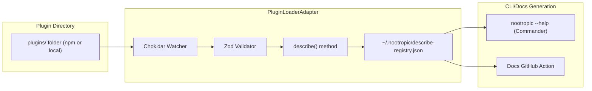

# Plugin Discovery & Registry Subsystem

## Overview

The Plugin Discovery & Registry Subsystem is responsible for managing local plugins, their discovery, validation, and integration into the nootropic ecosystem. It provides a robust mechanism for loading and managing plugins while ensuring security and performance.

## Architecture



## Components

### 1. Plugin Directory

#### Local Plugin Storage
- `plugins/` folder for local plugins
- NPM package support
- Local development plugins
- Plugin versioning

#### Plugin Structure
```typescript
interface Plugin {
  name: string;
  version: string;
  description: string;
  author: string;
  commands: Command[];
  hooks: Hook[];
  dependencies: string[];
}
```

### 2. PluginLoaderAdapter

#### File System Watcher
```typescript
interface PluginWatcher {
  watch(): void;
  onAdd(path: string): void;
  onRemove(path: string): void;
  onChange(path: string): void;
}
```

#### Plugin Validation
```typescript
interface PluginValidator {
  validate(plugin: Plugin): ValidationResult;
  checkDependencies(plugin: Plugin): DependencyResult;
  verifySecurity(plugin: Plugin): SecurityResult;
}
```

#### Plugin Registry
```typescript
interface PluginRegistry {
  register(plugin: Plugin): void;
  unregister(pluginName: string): void;
  getPlugin(name: string): Plugin;
  listPlugins(): Plugin[];
}
```

### 3. Documentation Generation

#### CLI Help Generation
```typescript
interface HelpGenerator {
  generateCommandHelp(command: Command): string;
  generatePluginHelp(plugin: Plugin): string;
  generateGlobalHelp(): string;
}
```

#### Documentation Action
```yaml
name: Generate Plugin Docs
on:
  push:
    paths:
      - 'plugins/**'
      - 'libs/adapters/plugin-loader/**'

jobs:
  generate-docs:
    runs-on: ubuntu-latest
    steps:
      - uses: actions/checkout@v2
      - name: Generate Docs
        run: npm run generate:plugin-docs
```

## Implementation Details

### 1. Plugin Discovery

#### File System Monitoring
```typescript
class PluginWatcher {
  private watcher: chokidar.FSWatcher;

  constructor(private pluginDir: string) {
    this.watcher = chokidar.watch(pluginDir, {
      ignored: /(^|[\/\\])\../,
      persistent: true
    });
  }

  watch(): void {
    this.watcher
      .on('add', this.onAdd.bind(this))
      .on('unlink', this.onRemove.bind(this))
      .on('change', this.onChange.bind(this));
  }
}
```

#### Plugin Loading
```typescript
class PluginLoader {
  async loadPlugin(path: string): Promise<Plugin> {
    const manifest = await this.readManifest(path);
    const validated = await this.validate(manifest);
    return this.initialize(validated);
  }

  private async readManifest(path: string): Promise<PluginManifest> {
    const manifestPath = join(path, 'plugin.json');
    return JSON.parse(await readFile(manifestPath, 'utf-8'));
  }
}
```

### 2. Plugin Validation

#### Schema Validation
```typescript
const pluginSchema = z.object({
  name: z.string(),
  version: z.string(),
  description: z.string(),
  author: z.string(),
  commands: z.array(commandSchema),
  hooks: z.array(hookSchema),
  dependencies: z.array(z.string())
});
```

#### Security Checks
```typescript
class SecurityValidator {
  async validate(plugin: Plugin): Promise<SecurityResult> {
    const checks = [
      this.checkPermissions(plugin),
      this.checkDependencies(plugin),
      this.checkCodeQuality(plugin)
    ];
    return Promise.all(checks);
  }
}
```

### 3. Registry Management

#### Registry Operations
```typescript
class PluginRegistry {
  private registry: Map<string, Plugin>;

  register(plugin: Plugin): void {
    this.validate(plugin);
    this.registry.set(plugin.name, plugin);
    this.persist();
  }

  private persist(): void {
    const registryPath = join(homedir(), '.nootropic', 'describe-registry.json');
    writeFile(registryPath, JSON.stringify(this.toJSON(), null, 2));
  }
}
```

## Performance Optimization

### 1. Plugin Loading

#### Lazy Loading
```typescript
class LazyPluginLoader {
  private loadedPlugins: Map<string, Promise<Plugin>>;

  async getPlugin(name: string): Promise<Plugin> {
    if (!this.loadedPlugins.has(name)) {
      this.loadedPlugins.set(name, this.loadPlugin(name));
    }
    return this.loadedPlugins.get(name);
  }
}
```

#### Caching
```typescript
class PluginCache {
  private cache: LRUCache<string, Plugin>;

  constructor() {
    this.cache = new LRUCache({
      max: 100,
      ttl: 1000 * 60 * 60 // 1 hour
    });
  }
}
```

### 2. File System Operations

#### Batch Processing
```typescript
class BatchPluginProcessor {
  private queue: Plugin[] = [];
  private processing = false;

  async add(plugin: Plugin): Promise<void> {
    this.queue.push(plugin);
    if (!this.processing) {
      await this.process();
    }
  }
}
```

## Error Handling

### 1. Plugin Errors

#### Error Types
```typescript
enum PluginErrorType {
  LOAD_ERROR = 'LOAD_ERROR',
  VALIDATION_ERROR = 'VALIDATION_ERROR',
  SECURITY_ERROR = 'SECURITY_ERROR',
  RUNTIME_ERROR = 'RUNTIME_ERROR'
}
```

#### Error Recovery
```typescript
class PluginErrorHandler {
  async handleError(error: PluginError): Promise<void> {
    switch (error.type) {
      case PluginErrorType.LOAD_ERROR:
        await this.handleLoadError(error);
        break;
      case PluginErrorType.VALIDATION_ERROR:
        await this.handleValidationError(error);
        break;
      // ...
    }
  }
}
```

## Testing

### 1. Unit Tests

```typescript
describe('PluginLoader', () => {
  it('should load valid plugin', async () => {
    const loader = new PluginLoader();
    const plugin = await loader.loadPlugin('test-plugin');
    expect(plugin).toBeDefined();
  });

  it('should validate plugin schema', async () => {
    const validator = new PluginValidator();
    const result = await validator.validate(invalidPlugin);
    expect(result.valid).toBe(false);
  });
});
```

### 2. Integration Tests

```typescript
describe('PluginRegistry', () => {
  it('should persist registry changes', async () => {
    const registry = new PluginRegistry();
    await registry.register(testPlugin);
    const loaded = await registry.load();
    expect(loaded.has(testPlugin.name)).toBe(true);
  });
});
```

## Usage Examples

### 1. Plugin Development

```typescript
// plugin.json
{
  "name": "my-plugin",
  "version": "1.0.0",
  "description": "My custom plugin",
  "author": "Developer",
  "commands": [
    {
      "name": "my-command",
      "description": "Custom command",
      "handler": "./handlers/my-command"
    }
  ]
}

// handlers/my-command.ts
export async function handler(args: string[]): Promise<void> {
  // Command implementation
}
```

### 2. Plugin Loading

```typescript
const loader = new PluginLoader();
const registry = new PluginRegistry();

// Load and register plugin
const plugin = await loader.loadPlugin('./plugins/my-plugin');
await registry.register(plugin);

// Use plugin
const command = plugin.commands.find(c => c.name === 'my-command');
await command.handler(['arg1', 'arg2']);
``` 