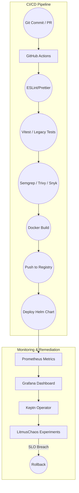

# Self-Healing CI/CD Subsystem

## Overview

The Self-Healing CI/CD Subsystem provides automated monitoring, remediation, and chaos testing capabilities to ensure system reliability and performance. It integrates with Keptn for SLO-based monitoring and LitmusChaos for chaos engineering.

## Architecture



## Components

### 1. CI/CD Pipeline

#### Pipeline Stages
- Code Quality
  * Linting and formatting
  * Unit testing
  * Security scanning
- Build and Package
  * Docker builds
  * Artifact management
- Deployment
  * Helm deployment
  * Health checks

#### Pipeline Configuration
```yaml
name: CI/CD Pipeline
on:
  push:
    branches: [main]
  pull_request:
    branches: [main]

jobs:
  build:
    runs-on: ubuntu-latest
    steps:
      - uses: actions/checkout@v2
      - name: Lint
        run: npm run lint
      - name: Test
        run: npm run test
      - name: Security Scan
        run: npm run security-scan
      - name: Build
        run: npm run build
      - name: Deploy
        run: npm run deploy
```

### 2. Monitoring & Remediation

#### Service Level Objectives
```yaml
apiVersion: keptn.sh/v1alpha3
kind: ServiceLevelObjective
metadata:
  name: response-time
spec:
  target: 200ms
  window: 5m
  indicators:
    - name: p95_latency
      query: histogram_quantile(0.95, rate(http_request_duration_seconds_bucket[5m]))
```

#### Remediation Actions
```yaml
apiVersion: keptn.sh/v1alpha3
kind: Remediation
metadata:
  name: high-latency
spec:
  triggers:
    - condition: p95_latency > 200ms
  actions:
    - name: scale-up
      action: kubectl scale deployment myapp --replicas=3
    - name: rollback
      action: helm rollback myapp
```

### 3. Chaos Testing

#### Chaos Scenarios
```yaml
apiVersion: litmuschaos.io/v1alpha1
kind: ChaosExperiment
metadata:
  name: pod-delete
spec:
  definition:
    scope: cluster
    permissions:
      - apiGroups: [""]
        resources: ["pods"]
        verbs: ["get", "list", "delete"]
    steps:
      - name: delete-pod
        action: delete
        target: random
```

#### Recovery Procedures
```yaml
apiVersion: litmuschaos.io/v1alpha1
kind: ChaosEngine
metadata:
  name: pod-delete
spec:
  engineState: active
  experiments:
    - name: pod-delete
      spec:
        components:
          runner:
            image: litmuschaos/chaos-runner:latest
          monitor:
            image: litmuschaos/chaos-exporter:latest
```

## Implementation Details

### 1. Monitoring

#### Prometheus Metrics
```typescript
interface Metrics {
  pipeline_duration_seconds: Histogram;
  deployment_success_rate: Gauge;
  slo_violation_count: Counter;
  remediation_attempts: Counter;
}

class MetricsCollector {
  private metrics: Metrics;

  constructor() {
    this.metrics = {
      pipeline_duration_seconds: new Histogram({
        name: 'pipeline_duration_seconds',
        help: 'Duration of CI/CD pipeline stages',
        labelNames: ['stage', 'status']
      }),
      // ...
    };
  }
}
```

#### Grafana Dashboards
```typescript
interface Dashboard {
  title: string;
  panels: Panel[];
  templating: Variable[];
  time: TimeRange;
}

class DashboardGenerator {
  generatePipelineDashboard(): Dashboard {
    return {
      title: 'CI/CD Pipeline Overview',
      panels: [
        this.createBuildStatusPanel(),
        this.createTestResultsPanel(),
        this.createSecurityScanPanel(),
        this.createDeploymentStatusPanel()
      ]
    };
  }
}
```

### 2. Remediation

#### Keptn Integration
```typescript
class KeptnController {
  async handleSLOViolation(violation: SLOViolation): Promise<void> {
    const remediation = await this.getRemediation(violation);
    await this.executeRemediation(remediation);
  }

  private async executeRemediation(remediation: Remediation): Promise<void> {
    for (const action of remediation.actions) {
      await this.executeAction(action);
    }
  }
}
```

#### Rollback Management
```typescript
class RollbackManager {
  async rollback(release: string): Promise<void> {
    const currentVersion = await this.getCurrentVersion();
    const previousVersion = await this.getPreviousVersion();
    await this.executeRollback(previousVersion);
    await this.verifyRollback();
  }
}
```

### 3. Chaos Testing

#### Experiment Runner
```typescript
class ChaosExperimentRunner {
  async runExperiment(experiment: ChaosExperiment): Promise<ExperimentResult> {
    await this.prepareEnvironment(experiment);
    const result = await this.executeExperiment(experiment);
    await this.cleanupEnvironment(experiment);
    return result;
  }
}
```

#### Recovery Handler
```typescript
class RecoveryHandler {
  async handleFailure(experiment: ChaosExperiment): Promise<void> {
    const recoveryPlan = await this.getRecoveryPlan(experiment);
    await this.executeRecovery(recoveryPlan);
    await this.verifyRecovery();
  }
}
```

## Performance Optimization

### 1. Pipeline Optimization

#### Parallel Execution
```typescript
class PipelineOptimizer {
  async optimizePipeline(pipeline: Pipeline): Promise<OptimizedPipeline> {
    const dependencies = this.analyzeDependencies(pipeline);
    return this.parallelizeStages(pipeline, dependencies);
  }
}
```

#### Caching Strategy
```typescript
class PipelineCache {
  private cache: Map<string, CacheEntry>;

  async getCachedResult(key: string): Promise<CacheEntry | null> {
    if (this.isValid(key)) {
      return this.cache.get(key);
    }
    return null;
  }
}
```

### 2. Monitoring Optimization

#### Metric Aggregation
```typescript
class MetricAggregator {
  private aggregations: Map<string, Aggregation>;

  aggregate(metric: Metric): void {
    const aggregation = this.getAggregation(metric.name);
    aggregation.update(metric.value);
  }
}
```

#### Alert Optimization
```typescript
class AlertManager {
  private alertRules: AlertRule[];

  async evaluateAlerts(metrics: Metric[]): Promise<Alert[]> {
    return Promise.all(
      this.alertRules.map(rule => this.evaluateRule(rule, metrics))
    );
  }
}
```

## Error Handling

### 1. Pipeline Errors

#### Error Types
```typescript
enum PipelineErrorType {
  BUILD_ERROR = 'BUILD_ERROR',
  TEST_ERROR = 'TEST_ERROR',
  DEPLOYMENT_ERROR = 'DEPLOYMENT_ERROR',
  REMEDIATION_ERROR = 'REMEDIATION_ERROR'
}
```

#### Error Recovery
```typescript
class PipelineErrorHandler {
  async handleError(error: PipelineError): Promise<void> {
    switch (error.type) {
      case PipelineErrorType.BUILD_ERROR:
        await this.handleBuildError(error);
        break;
      case PipelineErrorType.TEST_ERROR:
        await this.handleTestError(error);
        break;
      // ...
    }
  }
}
```

## Testing

### 1. Unit Tests

```typescript
describe('Pipeline', () => {
  it('should execute stages in order', async () => {
    const pipeline = new Pipeline();
    const result = await pipeline.execute();
    expect(result.status).toBe('success');
  });

  it('should handle stage failures', async () => {
    const pipeline = new Pipeline();
    const result = await pipeline.execute();
    expect(result.status).toBe('failed');
    expect(result.error).toBeDefined();
  });
});
```

### 2. Integration Tests

```typescript
describe('SelfHealing', () => {
  it('should detect SLO violations', async () => {
    const controller = new KeptnController();
    const violation = await controller.detectViolation();
    expect(violation).toBeDefined();
  });

  it('should execute remediation', async () => {
    const controller = new KeptnController();
    const result = await controller.remediate(violation);
    expect(result.success).toBe(true);
  });
});
```

## Usage Examples

### 1. Pipeline Configuration

```yaml
name: CI/CD Pipeline
on:
  push:
    branches: [main]
  pull_request:
    branches: [main]

jobs:
  build:
    runs-on: ubuntu-latest
    steps:
      - uses: actions/checkout@v2
      - name: Lint
        run: npm run lint
      - name: Test
        run: npm run test
      - name: Security Scan
        run: npm run security-scan
      - name: Build
        run: npm run build
      - name: Deploy
        run: npm run deploy
```

### 2. Self-Healing Configuration

```yaml
apiVersion: keptn.sh/v1alpha3
kind: ServiceLevelObjective
metadata:
  name: availability
spec:
  target: 0.999
  window: 1h
  indicators:
    - name: uptime
      query: sum(rate(http_requests_total[5m])) / sum(rate(http_requests_total[5m]))

---
apiVersion: litmuschaos.io/v1alpha1
kind: ChaosEngine
metadata:
  name: availability-test
spec:
  engineState: active
  experiments:
    - name: pod-delete
      spec:
        components:
          runner:
            image: litmuschaos/chaos-runner:latest
``` 