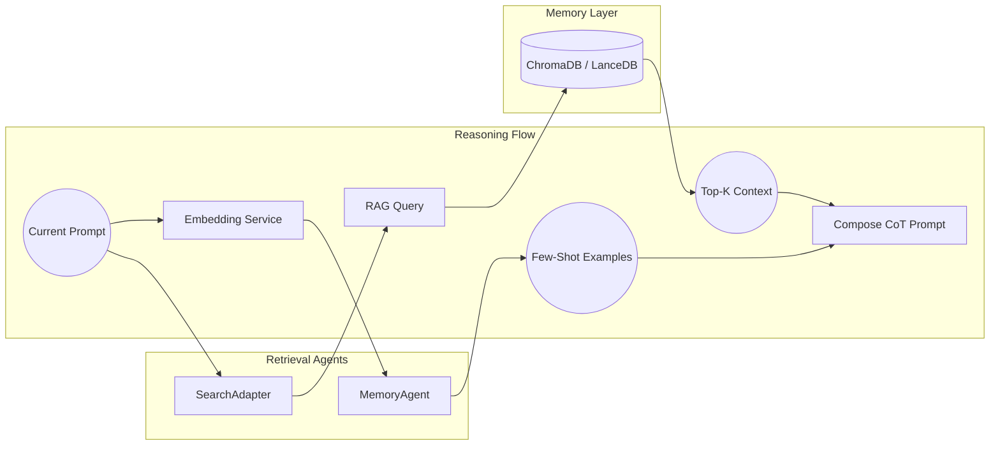

# Vector Retrieval & Memory Subsystem

## Overview

The Vector Retrieval & Memory Subsystem is a core component of nootropic that handles the storage, retrieval, and management of vector embeddings and associated metadata. It provides a unified interface for semantic search, memory management, and context retrieval across the system.

## Architecture



## Components

### 1. Memory Layer

The Memory Layer provides persistent storage for vector embeddings and associated metadata:

- **ChromaDB**: Primary vector store for semantic search
- **LanceDB**: Alternative vector store with different performance characteristics
- **SQLite**: Metadata and index storage
- **File System**: Raw document storage

### 2. Retrieval Agents

#### SearchAdapter

- Handles semantic search and retrieval
- Manages connections to vector stores
- Implements caching and optimization
- Provides unified interface for different backends

#### MemoryAgent

- Manages episodic memory
- Handles few-shot example retrieval
- Implements memory consolidation
- Provides context for reasoning

### 3. Reasoning Flow

#### Embedding Service

- Generates vector embeddings
- Handles batch processing
- Manages model loading
- Implements caching

#### RAG Query Processing

- Constructs search queries
- Handles query optimization
- Manages result ranking
- Implements filtering

#### Context Assembly

- Combines search results
- Formats context for prompts
- Manages token limits
- Handles context windowing

## Implementation Details

### 1. Vector Storage

```typescript
interface VectorStore {
  // Core operations
  add(vectors: Vector[], metadata: Metadata[]): Promise<void>;
  search(query: Vector, options: SearchOptions): Promise<SearchResult[]>;
  delete(ids: string[]): Promise<void>;
  
  // Batch operations
  batchAdd(vectors: Vector[], metadata: Metadata[]): Promise<void>;
  batchSearch(queries: Vector[], options: SearchOptions): Promise<SearchResult[][]>;
  
  // Management
  optimize(): Promise<void>;
  getStats(): StoreStats;
}
```

### 2. Memory Management

```typescript
interface MemoryManager {
  // Memory operations
  store(memory: Memory): Promise<void>;
  retrieve(query: MemoryQuery): Promise<Memory[]>;
  consolidate(): Promise<void>;
  
  // Memory types
  episodic: EpisodicMemory;
  semantic: SemanticMemory;
  working: WorkingMemory;
}
```

### 3. Embedding Generation

```typescript
interface EmbeddingService {
  // Core operations
  embed(text: string): Promise<Vector>;
  embedBatch(texts: string[]): Promise<Vector[]>;
  
  // Model management
  loadModel(modelId: string): Promise<void>;
  unloadModel(): Promise<void>;
  
  // Configuration
  setOptions(options: EmbeddingOptions): void;
}
```

## Performance Optimization

### 1. Caching Strategy

- In-memory LRU cache for frequent queries
- Disk-based cache for large result sets
- Cache invalidation based on document updates
- Cache warming for common queries

### 2. Query Optimization

- Query planning and optimization
- Parallel query execution
- Result streaming
- Early termination

### 3. Resource Management

- Connection pooling
- Memory usage limits
- Batch processing
- Resource cleanup

## Monitoring & Metrics

### 1. Performance Metrics

- Query latency
- Cache hit rate
- Memory usage
- Storage utilization

### 2. Quality Metrics

- Search relevance
- Memory retrieval accuracy
- Context quality
- Embedding quality

### 3. Health Checks

- Storage availability
- Memory health
- Resource utilization
- Error rates

## Error Handling

### 1. Error Types

```typescript
enum VectorRetrievalError {
  STORAGE_ERROR = 'STORAGE_ERROR',
  EMBEDDING_ERROR = 'EMBEDDING_ERROR',
  MEMORY_ERROR = 'MEMORY_ERROR',
  RESOURCE_ERROR = 'RESOURCE_ERROR'
}
```

### 2. Recovery Strategies

- Automatic retry with backoff
- Fallback to alternative stores
- Graceful degradation
- Error reporting

## Testing

### 1. Unit Tests

```typescript
describe('Vector Retrieval', () => {
  it('should handle basic search', async () => {
    // Test implementation
  });
  
  it('should manage memory correctly', async () => {
    // Test implementation
  });
});
```

### 2. Integration Tests

```typescript
describe('Vector Retrieval Integration', () => {
  it('should work with different stores', async () => {
    // Test implementation
  });
  
  it('should handle concurrent operations', async () => {
    // Test implementation
  });
});
```

## Usage Examples

### 1. Basic Search

```typescript
const searchAdapter = new SearchAdapter({
  vectorStore: {
    type: 'chroma',
    config: {
      // Configuration
    }
  }
});

const results = await searchAdapter.search({
  textQuery: 'How do I implement caching?',
  filters: {
    languages: ['typescript']
  }
});
```

### 2. Memory Management

```typescript
const memoryAgent = new MemoryAgent({
  storage: {
    type: 'lancedb',
    config: {
      // Configuration
    }
  }
});

const memories = await memoryAgent.retrieve({
  type: 'episodic',
  query: 'Recent code changes',
  limit: 5
});
```

### 3. Context Assembly

```typescript
const contextBuilder = new ContextBuilder({
  maxTokens: 2000,
  includeMetadata: true
});

const context = await contextBuilder.build({
  searchResults: results,
  memories: memories,
  format: 'markdown'
});
``` 