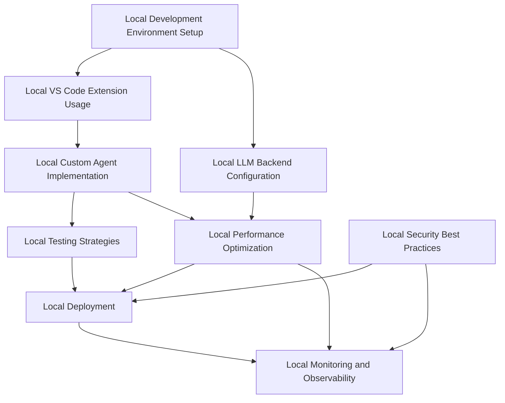
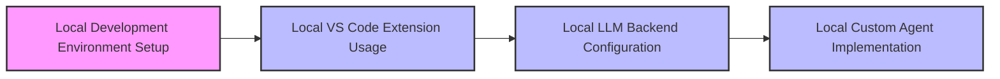
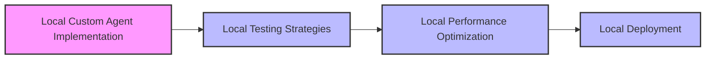
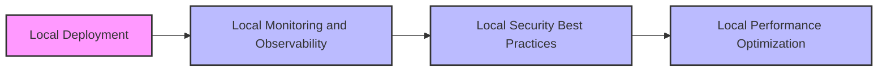
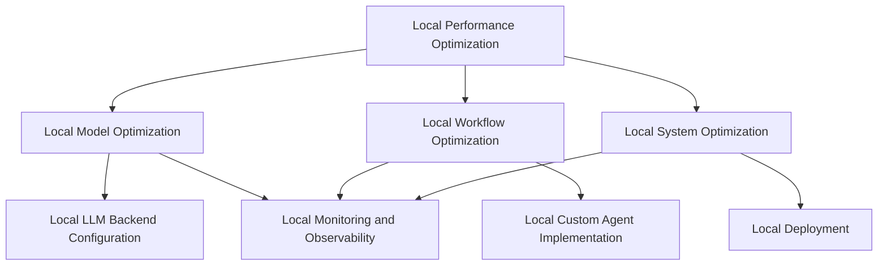
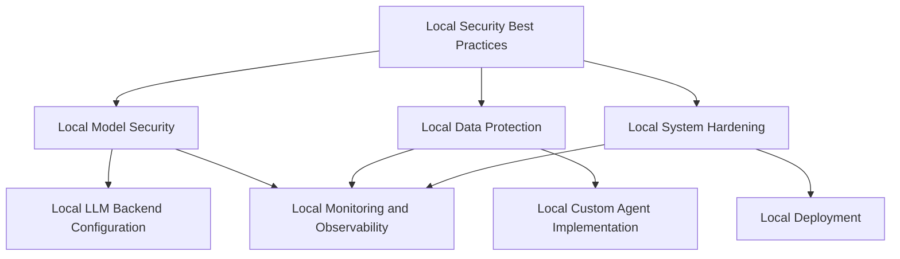
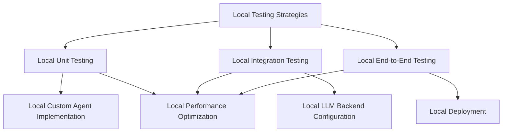
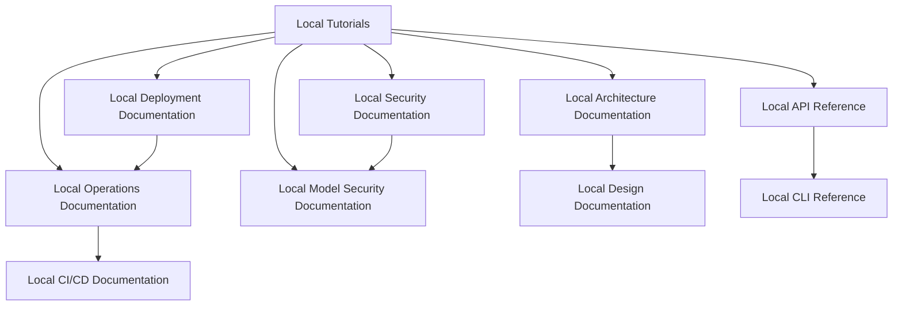
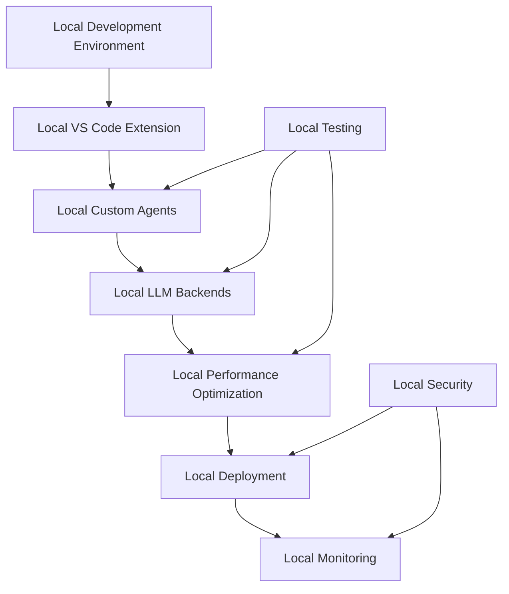
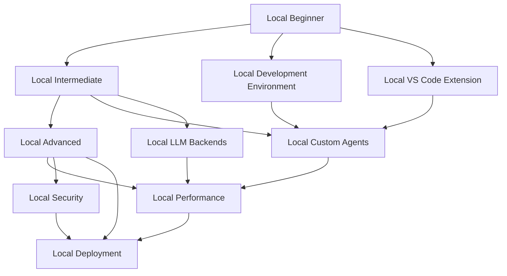

# Local-First Tutorial Diagrams

This document contains visual representations of local-first tutorial relationships, learning paths, and dependencies using Mermaid diagrams.

## Local Tutorial Dependencies

## Local Learning Paths

### New Users Path

### Local Developers Path

### Local Operations Path

## Local Topic Relationships

### Local Performance Optimization

### Local Security Best Practices

### Local Testing Strategies

## Local Documentation Relationships

## Local Component Dependencies

## Local Learning Progression

