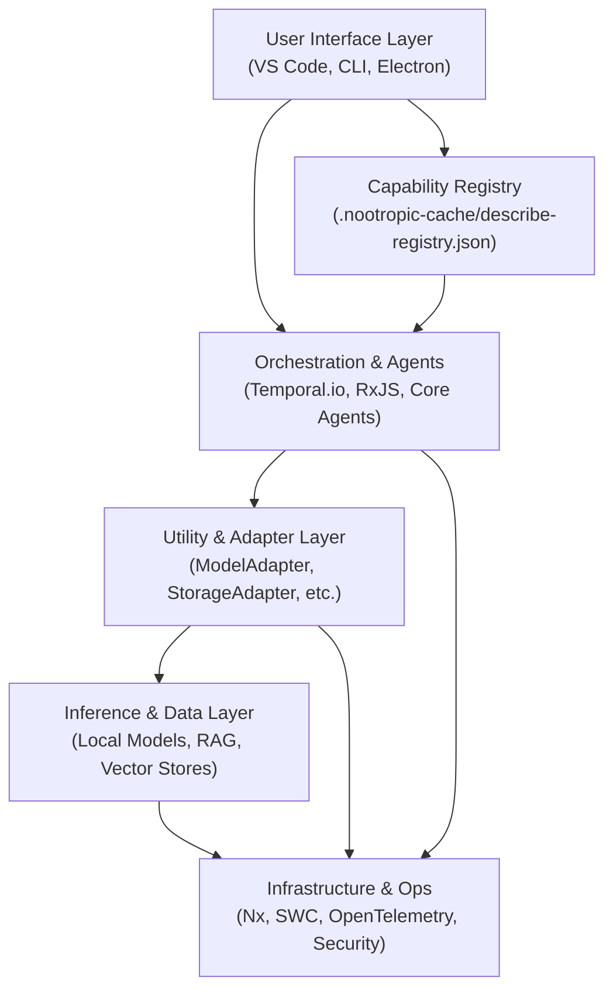
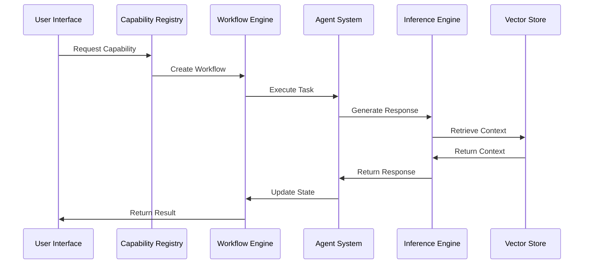

# MASTER BRIEF: Technical Specification

[](https://docs.nootropic.dev)
[](LICENSE)

> **NOTE**: This is the canonical technical specification document for the Nootropic project. It serves as the single source of truth for all technical details, specifications, and implementation guidelines.

## Executive Summary

Nootropic is a free-first, open-source AI/LLM-driven development environment and platform. Its chief aims are to provide developers with:

1. Advanced, dynamic project planning and management, through autonomous agents that decompose high-level intent into tasks, track state, and adjust plans in real time.
2. Deep code assistance and generation, leveraging local or cloud LLMs seamlessly (ModelAdapter) and integrating static analysis for continuous feedback (CriticAgent).
3. Rich RAG (Retrieval-Augmented Generation) capabilities, using vector stores like Chroma/LanceDB/Milvus/Weaviate so agents can query large code/document corpora without context window limits.
4. Self-healing and self-teaching loops, where telemetry from LLM calls, CI/CD pipelines, and user feedback feed nightly fine-tuning (LoRA) and automated remediation (Keptn + LitmusChaos).
5. A unified user experience across CLI, VS Code extension, and Electron UI, where slash commands or wizard flows guide users through scaffolding, coding, searching, debugging, and deployment—all orchestrated under Nx's monorepo.

Through modular micro-services (stateless containers and gRPC contracts), strong data-sovereign defaults (all code, embeddings, telemetry stay local unless explicitly opted into cloud), and a registry-driven plugin system, nootropic aspires to be the leanest yet most intelligent environment for AI-augmented software development.

## Core Principles

### 1. Free-First, Opt-In Cloud
- **Local-First Inference**: Default to locally quantized models (Ollama, llama.cpp, Tabby ML, vLLM, Exllama) for cost-free, privacy-preserving usage.
- **Cloud Fallback**: Users may opt into premium cloud LLMs (OpenAI, Anthropic, Google) via simple configuration—without sacrificing a baseline fully-offline experience.

### 2. Modular, Extensible Micro-Services
- Each capability (planning, coding, search, storage, observability) is packaged as a stateless container or Nx library target, communicating over gRPC + Protobuf and streaming event buses (ReflexionAdapter).
- Agents register themselves in a Capability Registry so that CLI/VS Code/Electron can discover and invoke them dynamically.

### 3. Data-Sovereign by Default
- All code, embeddings, telemetry, and agent traces are stored locally (ChromaDB, LanceDB, SQLite/LevelDB, Prometheus/Grafana on-prem).
- No external data egress unless the user configures ModelAdapter to route to cloud or shares telemetry.

### 4. Self-Awareness & Self-Healing
- Agents emit structured traces/logs that feed into telemetry (OpenTelemetry → Jaeger → Grafana).
- Keptn watches SLOs and Prometheus metrics; if a critical failure is detected, it can roll back or trigger a LitmusChaos experiment.
- Continuous feedback is logged for nightly LoRA fine-tuning of local models, gradually improving suggestion accuracy without cloud spend.

### 5. Declarative Goals & Autonomous Execution
- Developers state high-level intent in a project-spec.yaml. The ProjectMgrAgent translates that into PDDL, generates a task graph, and schedules tasks.
- Agents coordinate via a blackboard (vector + graph DB). Through a Reflexion Loop, they converge on working pull requests with minimal manual intervention.

### 6. Unified UX in IDE + CLI + Desktop
- VS Code Extension exposes slash commands for coding, planning, testing, and deployment.
- CLI offers registry-driven commands for all operations.
- Electron Dashboard provides Kanban boards, trace viewers, and real-time metrics/alerts.

## Table of Contents

1. [System Architecture](#1-system-architecture)
2. [Technical Specifications](#2-technical-specifications)
3. [Implementation Guidelines](#3-implementation-guidelines)
4. [Development Workflow](#4-development-workflow)
5. [Testing & Quality Assurance](#5-testing--quality-assurance)
6. [Deployment & Operations](#6-deployment--operations)
7. [Security & Compliance](#7-security--compliance)
8. [Performance & Scalability](#8-performance--scalability)
9. [Monitoring & Observability](#9-monitoring--observability)
10. [API Reference](#10-api-reference)
11. [Configuration Reference](#11-configuration-reference)
12. [Troubleshooting Guide](#12-troubleshooting-guide)
13. [Development Roadmap](#13-development-roadmap)
14. [Agent System Architecture](#14-agent-system-architecture)
15. [Model Management & Inference](#15-model-management--inference)
16. [Vector Store & RAG Implementation](#16-vector-store--rag-implementation)
17. [Workflow Engine & Task Management](#17-workflow-engine--task-management)
18. [Plugin System & Extensibility](#18-plugin-system--extensibility)
19. [Development Environment & Tooling](#19-development-environment--tooling)
20. [Data Management & Storage](#20-data-management--storage)
21. [Integration & API Design](#21-integration--api-design)

---

## 1. System Architecture

### 1.1 Core Architecture

The system follows a layered architecture pattern with clear separation of concerns and well-defined interfaces between layers. Each layer is responsible for specific functionality and communicates through standardized protocols.



### 1.2 Architectural Layers & Components

#### 1.2.1 User Interface Layer

##### VS Code Extension
- **Framework**: Continue + Roo Code + LSP (via vscode-languageclient/server)
- **Language**: TypeScript
- **Key Features**:
  - Inline chat interface
  - Slash commands
  - AST-safe diffs
  - Multi-file refactoring
  - Real-time collaboration
- **Dependencies**:
  - @nootropic/runtime
  - @nootropic/context
  - @nootropic/ui

##### CLI Client
- **Framework**: Commander.js + Nx executors
- **Language**: TypeScript
- **Key Features**:
  - Registry-driven commands
  - JSON/YAML output
  - Interactive wizards
  - Progress bars
- **Dependencies**:
  - @nootropic/runtime
  - @nootropic/cli
  - @nootropic/config

##### Electron Dashboard
- **Framework**: Electron + React (via Electron-React boilerplate) + Vite
- **Language**: TypeScript + React
- **Key Features**:
  - Kanban board for task graph
  - CoT logs for ExplainabilityAgent
  - Real-time metrics (Grafana iframe)
  - Plugin manager UI
- **Dependencies**:
  - @nootropic/ui
  - @nootropic/analytics
  - @nootropic/dashboard

#### 1.2.2 Capability Registry

##### Registry Format & Location
- **Path**: `.nootropic-cache/describe-registry.json`
- **Schema**: Zod validation
- **Update Frequency**: On-demand (plugin changes)

##### Registry Features
- **Plugin Discovery**: On startup, PluginLoaderAdapter scans plugins/, validates manifests via Zod, and writes entries to the registry.
- **Command Registration**: CLI, VS Code, Electron pull from registry to show available slash commands / subcommands.
- **Dependency Resolution**: Ensures that if a plugin requires a particular agent or adapter, that dependency is installed or loaded.
- **Version Compatibility**: Registry checks that plugin's compatibility (e.g., requires >=1.0.0 of ModelAdapter).

#### 1.2.3 Orchestration Layer

##### Workflow Engine (Temporal.io)
- **Version**: 1.23+
- **Features**:
  - Durable workflows
  - Time travel debugging
  - Event sourcing
  - State management
- **Configuration**:
  ```yaml
  temporal:
    version: "1.23"
    persistence:
      store: "sqlite"
      path: ".nootropic-cache/temporal"
    workflow:
      timeout: "1h"
      retryPolicy:
        maxAttempts: 3
        backoff: "exponential"
  ```

##### Event Processing (RxJS)
- **Version**: 8.0+
- **Features**:
  - Reactive streams for per-agent event buses
  - Event filtering and transformation
  - State management
  - Error handling with backpressure
- **Configuration**:
  ```typescript
  interface RxJSConfig {
    bufferSize: number;
    backpressureStrategy: 'drop' | 'buffer' | 'error';
    errorHandling: 'retry' | 'skip' | 'fail';
  }
  ```

##### Agent System
Each "Agent" is an Nx library (under libs/agents/) that runs as a separate process or container, exposing gRPC endpoints and participating in the Reflexion event bus.

1. **PlannerAgent**
   - Purpose: Reads project-spec.yaml, generates PDDL domain/problem, invokes Fast-Downward
   - Outputs: TaskGraph.json with dependencies, costs, resource constraints
   - Persistence: Snapshots state in LevelDB

2. **CoderAgent**
   - Purpose: Takes tasks, crafts CoT prompts, generates/refactors code
   - Inputs: Task requirements, context from MemoryAgent/SearchAgent
   - Outputs: Diff patches via Unified-Diff Parser
   - Feedback Loop: Triggers CriticAgent after patches

3. **CriticAgent**
   - Purpose: Static analysis and test execution
   - Tools: Semgrep with AI Autofix, OpenRewrite
   - Outputs: Lint/security violations, quality reports
   - Auto-fix: Triggers CoderAgent for remediation

4. **ReasoningAgent**
   - Purpose: Abstract problem-solving
   - Capabilities: SQL optimization, auth flow migration
   - Integration: Local/cloud LLMs via ModelAdapter
   - Output: High-level plans or PRs

5. **SearchAgent**
   - Purpose: RAG and context retrieval
   - Vector Stores: ChromaDB (primary), LanceDB (fallback)
   - Pipeline: File watching → chunking → embedding → upsert
   - Query: Top-k passage retrieval for RAG

6. **FeedbackAgent**
   - Purpose: User feedback collection and model improvement
   - Storage: Episodes in MemoryAgent
   - Fine-Tuning: Nightly LoRA jobs via Temporal
   - Metrics: Acceptance rates, suggestion quality

7. **ProjectMgrAgent**
   - Purpose: Project coordination and tracking
   - Features: Task tracking, burndown charts, sprint management
   - Integration: SLO monitoring, event store
   - UI Updates: Kanban board, progress markers

8. **ExplainabilityAgent**
   - Purpose: CoT logs and reasoning traces
   - Storage: LevelDB/SQLite for trace inspection
   - Integration: LLM call hooks via ModelAdapter
   - UI: Trace viewer in Electron dashboard

9. **MemoryAgent**
   - Purpose: Episodic memory store
   - Storage: Embeddings in Chroma/LanceDB
   - Use Cases: Few-shot examples, past fixes
   - Integration: CoderAgent context retrieval

10. **ObservabilityAgent**
    - Purpose: Telemetry and monitoring
    - Metrics: Prometheus endpoints
    - Tracing: OTLP spans to Jaeger
    - Dashboards: Grafana integration

##### Agent Communication
- **Protocol**: gRPC
- **Message Format**: Protocol Buffers
- **Features**:
  - Bidirectional streaming
  - Load balancing
  - Service discovery
  - Health checking

#### 1.2.4 Utility Layer

##### ModelAdapter
- **Purpose**: Unified interface to multiple LLM backends
- **Local Runtimes**:
  - Ollama via local REST (http://localhost:11434/api/chat, /api/generate)
  - llama.cpp for CPU/GPU inference (GGUF/GGML, Q4/Q5 quantization)
  - Tabby ML as self-hosted completion server (vLLM)
  - LM Studio for model management (GGUF + hardware acceleration)
- **Cloud Runtimes** (Opt-In):
  - OpenAI (GPT-4, GPT-4 Turbo)
  - Anthropic (Claude Opus/4)
  - HuggingFace Inference endpoints
  - Petals for P2P large model inference
- **Model Registry**:
  - JSON/SQLite-backed registry (model-metadata.json)
  - Tracks: name, version, format, quantization, hardware support, cost
  - Hardware detection for optimal model selection

##### StorageAdapter
- **Purpose**: Uniform API to various storage backends
- **Vector Operations**:
  - upsertEmbedding(), queryEmbeddings(), deleteEmbeddings()
  - ChromaDB (primary), LanceDB (fallback), Milvus/Weaviate (large scale)
- **Document Operations**:
  - storeDocument(), searchDocument(), deleteDocument()
  - Elasticsearch or SQLite FTS5 for full-text search
- **Cache Management**:
  - In-memory (Node-Cache) for ephemeral data
  - Redis for session tokens, rate limits
- **Backup/Restore**:
  - Chroma → MinIO snapshots
  - SQLite → S3 dumps
  - Milvus collection migration

##### ObservabilityAdapter
- **Purpose**: OpenTelemetry instrumentation
- **Metrics**:
  - Span metrics for gRPC calls
  - Business metrics (code generation success, test pass rate)
  - Prometheus/Grafana integration
- **Tracing**:
  - OTLP spans to Jaeger
  - Trace context propagation
  - Sampling configuration
- **Logging**:
  - Structured JSON logs
  - Log aggregation (Fluentd/Loki)
  - Log level management

##### PluginLoaderAdapter
- **Purpose**: Dynamic plugin management
- **Discovery**:
  - Chokidar file watching
  - Plugin manifest validation (Zod)
  - Dependency resolution
- **Loading**:
  - npm link / pnpm workspace protocol
  - Capability registration
  - Event hook wiring
- **Lifecycle**:
  - Plugin initialization
  - Version compatibility checks
  - Graceful shutdown

##### ReflexionAdapter
- **Purpose**: Reflexion State Machine (RSM)
- **Event Management**:
  - gRPC streaming topics
  - Node.js EventEmitter fallback
  - Durable event log (LevelDB/SQLite)
- **Self-Healing**:
  - Keptn integration
  - Event pattern detection
  - Automated remediation
- **State Management**:
  - Event replay on restart
  - State snapshots
  - Consistency checks

#### 1.2.5 Inference Layer

##### Local Models
- **Supported Runtimes**:
  1. llama.cpp
     - Format: 4-bit GGUF
     - Features: CPU/GPU inference
     - Optimization: SIMD, BLAS

  2. Ollama
     - Format: GGUF/MLX
     - Features: Model management
     - Optimization: Metal, CUDA

  3. vLLM
     - Format: PagedAttention
     - Features: GPU acceleration
     - Optimization: KV cache

  4. StarCoder2/Llama2
     - Format: LoRA checkpoints
     - Features: Fine-tuning
     - Optimization: Gradient checkpointing

##### Vector Stores
- **Supported Stores**:
  1. Chroma
     - Backend: SQLite + FAISS
     - Features: Hybrid search
     - Optimization: IVF index

  2. LanceDB
     - Backend: Arrow
     - Features: Columnar storage
     - Optimization: SIMD

  3. Weaviate
     - Backend: Hybrid
     - Features: GraphQL API
     - Optimization: BM25 + HNSW

##### RAG Pipeline
- **Components**:
  1. Document Processing
     - Chunking strategy
     - Embedding generation
     - Metadata extraction

  2. Index Management
     - Vector indexing
     - Metadata indexing
     - Version control

  3. Query Processing
     - Query parsing
     - Context retrieval
     - Result ranking

#### 1.2.6 Infrastructure Layer

##### Orchestration
- **Temporal.io**
  - Version: 1.23
  - Features: Durable workflows
  - Configuration: SQLite backend

##### CI/CD
- **Nx 16**
  - Features: Distributed caching
  - Configuration: 20× faster builds

##### Observability
- **OpenTelemetry 1.30**
  - Features: Distributed tracing
  - Configuration: Cost attribution

##### Security
- **Semgrep 1.50**
  - Features: In-process SAST
  - Configuration: Autofix enabled

##### Containerization
- **Docker**
  - Features: Service isolation
  - Configuration: Multi-stage builds

### 1.3 Data Flow



### 1.4 Error Handling

#### 1.4.1 Error Types
1. **System Errors**
   - Hardware failures
   - Network issues
   - Resource exhaustion

2. **Application Errors**
   - Invalid input
   - State conflicts
   - Timeout errors

3. **Business Errors**
   - Validation failures
   - Policy violations
   - SLA breaches

#### 1.4.2 Recovery Strategies
1. **Automatic Recovery**
   - Retry with backoff
   - State restoration
   - Resource reallocation

2. **Manual Recovery**
   - Human intervention
   - State inspection
   - Manual correction

3. **Fallback Mechanisms**
   - Alternative models
   - Backup systems
   - Degraded operation

### 1.5 Security Architecture

#### 1.5.1 Authentication
- OAuth2/OpenID Connect
- JWT-based sessions
- API key management
- Role-based access control

#### 1.5.2 Data Protection
- AES-256-GCM encryption
- Secure key management
- Data anonymization
- Privacy-preserving processing

#### 1.5.3 Compliance
- SLSA Level 3
- Supply chain security
- Vulnerability scanning
- Audit logging

## 2. Technical Specifications

### 2.1 System Requirements

#### 2.1.1 Hardware Requirements
- **Minimum**
  - CPU: 4 cores
  - RAM: 8GB
  - Storage: 20GB SSD
  - GPU: Optional (NVIDIA with 4GB VRAM)

- **Recommended**
  - CPU: 8 cores
  - RAM: 16GB
  - Storage: 50GB SSD
  - GPU: NVIDIA with 8GB+ VRAM

#### 2.1.2 Software Requirements
- **Operating System**
  - Linux (Ubuntu 20.04+)
  - macOS (12.0+)
  - Windows (WSL2)

- **Dependencies**
  - Node.js 18+
  - Python 3.9+
  - Docker 20.10+
  - Git 2.30+

### 2.2 Performance Specifications

#### 2.2.1 Latency Targets
- **Inference**
  - Small models: <100ms
  - Large models: <1s
  - Vector search: <50ms

- **UI Response**
  - Command execution: <200ms
  - Code generation: <2s
  - Context retrieval: <100ms

#### 2.2.2 Throughput Targets
- **Inference**
  - Small models: 100+ req/s
  - Large models: 10+ req/s
  - Vector operations: 1000+ ops/s

- **Development**
  - Build time: <2s (incremental)
  - Test execution: <5s
  - Plugin loading: <100ms

### 2.3 Security Specifications

#### 2.3.1 Authentication
- OAuth2/OpenID Connect
- JWT-based sessions
- API key management
- Role-based access control

#### 2.3.2 Data Protection
- AES-256-GCM encryption
- Secure key management
- Data anonymization
- Privacy-preserving processing

#### 2.3.3 Compliance
- SLSA Level 3
- Supply chain security
- Vulnerability scanning
- Audit logging

## 3. Implementation Guidelines

### 3.1 Development Setup

```bash
# Clone repository
git clone https://github.com/nootropic/nootropic.git
cd nootropic

# Install dependencies
npm install

# Build project
npm run build

# Start development server
npm run dev
```

### 3.2 Project Structure

```
nootropic/
├── apps/                    # Application packages
│   ├── cli/                # CLI client
│   ├── electron/           # Electron dashboard
│   └── vscode/             # VS Code extension
├── libs/                    # Shared libraries
│   ├── runtime/            # Core runtime
│   ├── context/            # Context management
│   └── ui/                 # UI components
├── plugins/                 # Plugin packages
├── .nootropic-cache/       # Cache directory
├── .vectorstore/           # Vector store data
├── project-spec.md         # Project specification
├── nx.json                 # Nx configuration
├── workspace.json          # Workspace configuration
└── tsconfig.base.json      # TypeScript configuration
```

### 3.3 Coding Standards

#### 3.3.1 TypeScript
- Strict mode enabled
- No implicit any
- Explicit return types
- Interface over type
- No unused variables

#### 3.3.2 Testing
- Unit tests required
- Integration tests for APIs
- E2E tests for UI
- Coverage minimum: 80%

#### 3.3.3 Documentation
- JSDoc for public APIs
- README for packages
- Architecture diagrams
- API documentation

### 3.4 Plugin Development

```typescript
// Example plugin structure
export function describe() {
  return {
    name: "example-plugin",
    version: "1.0.0",
    capabilities: ["feature1", "feature2"],
    configSchema: {
      enabled: true,
      options: {
        type: "object",
        properties: {
          // Schema definition
        }
      }
    }
  };
}
```

## 4. Development Workflow

### 4.1 Git Workflow

1. **Branch Strategy**
   - main: Production-ready code
   - develop: Integration branch
   - feature/*: New features
   - bugfix/*: Bug fixes
   - release/*: Release preparation

2. **Commit Guidelines**
   - Conventional commits
   - Signed commits
   - Atomic commits
   - Descriptive messages

3. **Pull Request Process**
   - Issue reference
   - Description
   - Tests
   - Documentation
   - Review required

### 4.2 CI/CD Pipeline

```yaml
# Example GitHub Actions workflow
name: CI/CD

on:
  push:
    branches: [main, develop]
  pull_request:
    branches: [main, develop]

jobs:
  build:
    runs-on: ubuntu-latest
    steps:
      - uses: actions/checkout@v3
      - uses: actions/setup-node@v3
      - run: npm ci
      - run: npm run build
      - run: npm run test
      - run: npm run lint
```

### 4.3 Release Process

1. **Version Management**
   - Semantic versioning
   - Changelog updates
   - Release notes
   - Tag creation

2. **Deployment Steps**
   - Build artifacts
   - Run tests
   - Deploy to staging
   - Deploy to production

3. **Post-Release**
   - Monitor metrics
   - Check logs
   - Update documentation
   - Announce release

## 5. Testing & Quality Assurance

### 5.1 Test Categories

1. **Unit Tests**
   - Component testing
   - Function testing
   - Mock dependencies
   - Fast execution

2. **Integration Tests**
   - API testing
   - Service testing
   - Database testing
   - External services

3. **E2E Tests**
   - UI testing
   - Workflow testing
   - User scenarios
   - Performance testing

### 5.2 Quality Metrics

1. **Code Quality**
   - Test coverage
   - Static analysis
   - Complexity metrics
   - Documentation coverage

2. **Performance Metrics**
   - Response time
   - Throughput
   - Resource usage
   - Error rates

3. **Security Metrics**
   - Vulnerability scan
   - Dependency audit
   - Code review
   - Security testing

## 6. Deployment & Operations

### 6.1 Deployment Options

1. **Local Deployment**
   - Docker containers
   - Local services
   - Development mode
   - Debug support

2. **Cloud Deployment**
   - Kubernetes
   - Cloud services
   - Load balancing
   - Auto-scaling

3. **Hybrid Deployment**
   - Edge computing
   - Cloud integration
   - Data synchronization
   - Failover support

### 6.2 Operational Procedures

1. **Monitoring**
   - Health checks
   - Performance metrics
   - Error tracking
   - Resource usage

2. **Maintenance**
   - Backup procedures
   - Update process
   - Security patches
   - Data cleanup

3. **Disaster Recovery**
   - Backup restoration
   - Service recovery
   - Data recovery
   - Incident response

## 7. Security & Compliance

### 7.1 Security Measures

1. **Authentication**
   - Multi-factor auth
   - Session management
   - Access control
   - Audit logging

2. **Data Protection**
   - Encryption at rest
   - Encryption in transit
   - Key management
   - Data backup

3. **Network Security**
   - Firewall rules
   - VPN access
   - DDoS protection
   - Traffic monitoring

### 7.2 Compliance Requirements

1. **Data Privacy**
   - GDPR compliance
   - CCPA compliance
   - Data retention
   - User consent

2. **Security Standards**
   - ISO 27001
   - SOC 2
   - NIST framework
   - OWASP guidelines

## 8. Performance & Scalability

### 8.1 Performance Optimization

1. **Code Optimization**
   - Algorithm efficiency
   - Memory usage
   - CPU utilization
   - I/O operations

2. **Resource Management**
   - Connection pooling
   - Cache management
   - Load balancing
   - Resource limits

3. **Monitoring & Tuning**
   - Performance metrics
   - Bottleneck detection
   - Resource allocation
   - Optimization cycles

### 8.2 Scaling Strategies

1. **Horizontal Scaling**
   - Load distribution
   - Service replication
   - Data sharding
   - State management

2. **Vertical Scaling**
   - Resource upgrade
   - Performance tuning
   - Capacity planning
   - Cost optimization

## 9. Monitoring & Observability

### 9.1 Monitoring Stack

1. **Metrics Collection**
   - Prometheus
   - OpenTelemetry
   - Custom metrics
   - Business metrics

2. **Logging**
   - Centralized logging
   - Log aggregation
   - Log analysis
   - Alert rules

3. **Tracing**
   - Distributed tracing
   - Request tracking
   - Performance analysis
   - Error tracking

### 9.2 Alerting & Notifications

1. **Alert Rules**
   - Threshold-based
   - Anomaly detection
   - Business rules
   - Custom conditions

2. **Notification Channels**
   - Email
   - Slack
   - PagerDuty
   - Custom webhooks

## 10. API Reference

### 10.1 Core APIs

1. **Agent API**
   - Task execution
   - State management
   - Event handling
   - Error handling

2. **Model API**
   - Inference
   - Fine-tuning
   - Model management
   - Performance metrics

3. **Storage API**
   - Vector operations
   - Document management
   - Cache control
   - Backup/restore

### 10.2 Plugin APIs

1. **Extension Points**
   - Command registration
   - Event handling
   - UI integration
   - Data access

2. **Integration APIs**
   - External services
   - Data sources
   - Authentication
   - Communication

## 11. Configuration Reference

### 11.1 System Configuration

```yaml
# Example configuration
system:
  version: "1.0.0"
  environment: "production"
  debug: false
  logging:
    level: "info"
    format: "json"
  security:
    encryption: "aes-256-gcm"
    keyRotation: "30d"
```

### 11.2 Component Configuration

1. **Agent Configuration**
   - Task settings
   - Resource limits
   - Timeout values
   - Retry policies

2. **Model Configuration**
   - Model selection
   - Parameters
   - Performance settings
   - Cost limits

3. **Storage Configuration**
   - Database settings
   - Cache configuration
   - Backup schedule
   - Retention policy

## 12. Troubleshooting Guide

### 12.1 Common Issues

1. **Performance Issues**
   - High latency
   - Resource exhaustion
   - Memory leaks
   - CPU spikes

2. **Integration Issues**
   - API failures
   - Data sync problems
   - Authentication errors
   - Network issues

3. **Deployment Issues**
   - Build failures
   - Deployment errors
   - Configuration problems
   - Environment issues

### 12.2 Debug Procedures

1. **Log Analysis**
   - Error patterns
   - Performance metrics
   - User behavior
   - System state

2. **Diagnostic Tools**
   - Debug logging
   - Performance profiling
   - Memory analysis
   - Network tracing

## 13. Development Roadmap

### 13.1 Short-term Goals (3 months)

1. **Core Features**
   - Enhanced agent capabilities
   - Improved model performance
   - Extended language support
   - Advanced debugging tools

2. **Infrastructure**
   - Scalability improvements
   - Performance optimization
   - Security enhancements
   - Monitoring upgrades

### 13.2 Medium-term Goals (6 months)

1. **Platform Features**
   - Advanced AI capabilities
   - Extended plugin system
   - Enhanced UI/UX
   - Improved documentation

2. **Technical Improvements**
   - Architecture optimization
   - Performance tuning
   - Security hardening
   - Reliability improvements

### 13.3 Long-term Goals (12 months)

1. **Strategic Initiatives**
   - AI research integration
   - Platform expansion
   - Community growth
   - Enterprise features

2. **Technical Vision**
   - Next-gen architecture
   - Advanced AI capabilities
   - Global scalability
   - Industry leadership

## 14. Contributing Guidelines

### 14.1 Development Process

1. **Getting Started**
   - Environment setup
   - Code review
   - Testing requirements
   - Documentation

2. **Code Standards**
   - Style guide
   - Best practices
   - Review process
   - Quality checks

### 14.2 Community Guidelines

1. **Communication**
   - Issue reporting
   - Feature requests
   - Bug fixes
   - Documentation

2. **Collaboration**
   - Code review
   - Testing
   - Documentation
   - Support

---

## 15. Agent System Architecture

### 15.1 Detailed Agent Specifications
- PlannerAgent
- CoderAgent
- CriticAgent
- ReasoningAgent
- SearchAgent
- FeedbackAgent
- ProjectMgrAgent
- ExplainabilityAgent
- MemoryAgent
- ObservabilityAgent
- PluginLoaderAdapter
- ModelAdapter
- StorageAdapter
- ReflexionAdapter

### 15.2 Agent Communication Protocols
- gRPC
- Protocol Buffers
- Message streaming
- Load balancing
- Service discovery
- Health checking

### 15.3 State Management & Persistence
- Event sourcing
- Durable workflows
- State snapshots
- Persistence layers (SQLite, LevelDB)
- Recovery on restart

### 15.4 Error Handling & Recovery Mechanisms
- Retry policies
- Backoff strategies
- Circuit breakers
- Fallback agents
- Logging and alerts

## 16. Model Management & Inference

### 16.1 Model Specifications & Requirements
- Supported formats (GGUF, GGML, LoRA)
- Hardware requirements (CPU, GPU, memory)
- Quantization levels
- Compatibility matrix

### 16.2 Inference Pipeline Architecture
- Input preprocessing
- Tokenization
- Model invocation
- Output postprocessing
- Batch processing

### 16.3 Model Versioning & Deployment
- Semantic versioning for models
- Model registry
- Canary deployments
- Rollback procedures

### 16.4 Performance Optimization Techniques
- Quantization strategies
- Pruning and distillation
- Caching and batching
- Hardware acceleration (CUDA, Metal)

### 16.5 Cost Management & Resource Allocation
- On-prem vs. cloud tradeoffs
- Spot instance usage
- Auto-scaling
- Quota enforcement

## 17. Vector Store & RAG Implementation

### 17.1 Vector Store Architecture & Configuration
- Chroma
- LanceDB
- Milvus
- Weaviate
- Qdrant
- FAISS
- Configuration options (index type, storage path)

### 17.2 RAG Pipeline Specifications
- Document ingestion
- Chunking strategies
- Embedding generation
- Index maintenance

### 17.3 Chunking & Embedding Strategies
- Overlapping windows
- Hybrid indices (text + metadata)
- Embedding models and parameters

### 17.4 Query Optimization & Caching
- K-NN search tuning
- Hybrid search (semantic + keyword)
- Query result caching
- TTL settings

### 17.5 Data Synchronization & Consistency
- Upserts and deletes
- Versioned indices
- Backup and restore
- Consistency guarantees

## 18. Workflow Engine & Task Management

### 18.1 Temporal.io Workflow Specifications
- Workflow definitions
- Activity registration
- Retry and timeout policies
- Versioning workflows

### 18.2 Task Graph Implementation
- PDDL to task graph transformation
- DAG representation
- Dependency resolution
- Task prioritization

### 18.3 State Machine Definitions
- Event types
- State transitions
- Side effects
- Compensation logic

### 18.4 Event Handling & Processing
- Reactive streams (RxJS)
- Event bus (gRPC streams)
- Buffering and backpressure
- Error streams

### 18.5 Workflow Monitoring & Debugging
- Temporal Web UI
- Logging and tracing
- Metrics (duration, failure rates)
- Alerting thresholds

## 19. Plugin System & Extensibility

### 19.1 Plugin Architecture & Lifecycle
- Plugin discovery
- Loading and unloading
- Capability registration
- Version compatibility

### 19.2 Extension Point Specifications
- Command registration
- Event hooks
- UI integrations
- Configuration schema

### 19.3 Plugin Development Guidelines
- Folder structure
- Required exports (describe function)
- Testing plugins
- Publishing to marketplace

### 19.4 Integration Patterns
- Plugin-to-agent communication
- Shared data contracts
- Isolation and sandboxing
- Security considerations

### 19.5 Version Compatibility
- Semantic versioning for plugins
- Dependency constraints
- Compatibility matrix
- Deprecation strategies

## 20. Development Environment & Tooling

### 20.1 Nx Workspace Configuration

#### 20.1.1 Workspace Structure
```
nootropic/
├── apps/                    # Application projects
│   ├── cli/                # CLI application
│   │   ├── src/
│   │   └── project.json
│   ├── electron/           # Electron application
│   │   ├── src/
│   │   └── project.json
│   ├── vscode/             # VS Code extension
│   │   ├── src/
│   │   └── project.json
│   ├── api/                # Nx app for REST/gRPC API (NestJS)
│   │   ├── src/
│   │   └── project.json
│   └── temporal/           # Nx app for Temporal worker
│       ├── src/
│       └── project.json
├── libs/                   # Shared libraries
│   ├── agents/
│   │   ├── planner-agent/       # PlannerAgent library
│   │   ├── coder-agent/
│   │   ├── critic-agent/
│   │   ├── reasoning-agent/
│   │   ├── search-agent/
│   │   ├── feedback-agent/
│   │   ├── project-mgr-agent/
│   │   ├── explainability-agent/
│   │   ├── memory-agent/
│   │   └── observability-agent/
│   ├── adapters/
│   │   ├── model-adapter/
│   │   ├── storage-adapter/
│   │   ├── observability-adapter/
│   │   ├── plugin-loader-adapter/
│   │   └── reflexion-adapter/
│   ├── shared/
│   │   ├── schemas/          # JSON schemas + Zod schemas
│   │   ├── utils/            # Helper functions, constants
│   │   └── project.json      # pkg name="@nootropic/shared"
│   ├── ui/                   # Shared UI components (React, Tailwind)
│   ├── runtime/              # Core runtime (logging, error classes, types)
│   └── context/              # Cross-cutting context management
├── tools/                    # Custom scripts & generators
├── plugins/                  # External plugin packages
├── .nootropic-cache/         # Runtime cache (registry, temporal, local DB)
├── .vectorstore/             # ChromaOnDisk or LanceDB data
├── project-spec.yaml         # Example project specification
├── nx.json                   # Nx configuration
├── workspace.json            # Combined workspace config
├── tsconfig.base.json        # Shared TS config with path aliases
└── pnpm-workspace.yaml       # Workspace package definitions
```

#### 20.1.2 Nx Configuration
```json
{
  "npmScope": "nootropic",
  "tasksRunnerOptions": {
    "default": {
      "runner": "@nrwl/workspace/tasks-runners/default",
      "options": {
        "cacheableOperations": ["build", "test", "lint", "e2e"],
        "parallel": 4,
        "cacheDirectory": "./node_modules/.cache/nx"
      }
    }
  },
  "projects": {
    "shared": { "tags": [] },
    "model-adapter": { "tags": [] }
    // ... other projects with tags, implicitDependencies
  }
}
```

### 20.2 Development Tools

#### 20.2.1 Core Tools
- **Nx (v16+)**: Monorepo management and build orchestration
- **pnpm (v8+)**: Package manager for dependency management
- **TypeScript (v5+)**: Language with NodeNext/ESM support
- **SWC (v0.2.x)**: Fast TypeScript compiler
- **Esbuild (v0.18+)**: Production bundler

#### 20.2.2 Testing Tools
- **Vitest (v3.x+)**: Primary test runner
- **Playwright (v1.33+)**: E2E testing for CLI and VS Code extension
- **Cypress (v12+)**: UI testing for Electron app

#### 20.2.3 Code Quality
- **ESLint (v8+)**: Code linting and style enforcement
- **Prettier (v2+)**: Code formatting
- **Semgrep (v1.30+)**: Security scanning
- **TypeDoc (v0.29+)**: API documentation generation

### 20.3 Development Workflow

#### 20.3.1 Local Development
```bash
# Install dependencies
pnpm install

# Start development server
pnpm nx run-many --target=serve --all

# Run tests
pnpm nx run-many --target=test --all

# Build projects
pnpm nx run-many --target=build --all
```

#### 20.3.2 Code Generation
```bash
# Generate new application
pnpm nx g @nx/js:app my-app

# Generate new library
pnpm nx g @nx/js:lib my-lib

# Generate new component
pnpm nx g @nx/react:component my-component --project=my-app
```

#### 20.3.3 Testing Strategy
```bash
# Run unit tests
pnpm nx test my-app

# Run E2E tests
pnpm nx e2e my-app-e2e

# Run affected tests
pnpm nx affected:test
```

### 20.4 IDE Integration

#### 20.4.1 VS Code Setup
```json
{
  "typescript.tsdk": "node_modules/typescript/lib",
  "typescript.enablePromptUseWorkspaceTsdk": true,
  "editor.formatOnSave": true,
  "editor.codeActionsOnSave": {
    "source.fixAll.eslint": true
  }
}
```

#### 20.4.2 Recommended Extensions
- ESLint
- Prettier
- Nx Console
- GitLens
- Error Lens

### 20.5 Build System

#### 20.5.1 Build Configuration
```typescript
// project.json
{
  "name": "my-app",
  "$schema": "../../node_modules/nx/schemas/project-schema.json",
  "sourceRoot": "apps/my-app/src",
  "projectType": "application",
  "targets": {
    "build": {
      "executor": "@nx/js:swc",
      "outputs": ["{options.outputPath}"],
      "options": {
        "outputPath": "dist/apps/my-app",
        "main": "apps/my-app/src/main.ts",
        "tsConfig": "apps/my-app/tsconfig.app.json",
        "assets": ["apps/my-app/src/assets"]
      }
    }
  }
}
```

#### 20.5.2 ESM Configuration
```json
// tsconfig.json
{
  "extends": "./tsconfig.base.json",
  "compilerOptions": {
    "module": "NodeNext",
    "moduleResolution": "NodeNext",
    "target": "ES2022",
    "strict": true
  }
}
```

### 20.6 Performance Optimization

#### 20.6.1 Build Optimization
- Distributed caching with Nx Cloud
- Incremental builds with SWC
- Tree shaking with Esbuild
- Parallel task execution

#### 20.6.2 Development Experience
- Fast refresh with Vite
- TypeScript project references
- ESLint caching
- Git hooks with Husky

### 20.7 Troubleshooting

#### 20.7.1 Common Issues
- Cache invalidation
- Dependency conflicts
- Build failures
- Test flakiness

#### 20.7.2 Debugging Tools
- Nx graph visualization
- Build logs
- Test coverage reports
- Performance profiling

## 21. Data Management & Storage

### 21.1 Data Models & Schemas
- Project specification schema
- Capability registry schema
- Agent state schema
- Metrics and logs schema

### 21.2 Storage Architecture
- Relational (PostgreSQL, SQLite)
- NoSQL (Redis, LevelDB)
- Object storage (MinIO, S3)
- File system structure

### 21.3 Caching Strategies
- In-memory caches (Redis)
- Local disk caches
- TTL and eviction policies
- Cache warming

### 21.4 Backup & Recovery
- Automated backup schedules
- Snapshotting vector stores
- Disaster recovery plans
- Restore procedures

### 21.5 Data Migration Procedures
- Schema migrations (Flyway, Liquibase)
- Data transformation scripts
- Versioned migration checkpoints
- Rollback procedures

## 22. Integration & API Design

### 22.1 API Architecture & Patterns
- REST vs. gRPC decisions
- Endpoint naming conventions
- Versioning strategies
- Pagination and filtering

### 22.2 Integration Protocols
- gRPC streaming patterns
- Webhooks and callbacks
- Authenticated vs. unauthenticated endpoints
- Rate limiting

### 22.3 Authentication & Authorization
- OAuth2 flows
- JWT token management
- Role-based access control
- API key management

### 22.4 Rate Limiting & Quotas
- Per-user vs. per-organization quotas
- Throttling policies
- Exponential backoff requirements
- Monitoring usage

### 22.5 API Versioning
- URI versioning (/v1/, /v2/)
- Deprecation policies
- Migration guides
- SDK support

## Sections
- Architecture diagrams
- Interface definitions
- Configuration schemas
- Implementation guidelines
- Performance requirements
- Security considerations

### 1.3 Nx Backbone & Development Workflow

#### 1.3.1 Why Nx?
- **Monorepo Orchestration**: Nx v16 organizes code into apps/, libs/, tools/ and manages implicit dependencies
- **Distributed Caching**: Nx Cloud or local caching speeds up rebuilds, tests, and e2e across the workspace
- **Generators & Executors**: Prebuilt Nx generators accelerate scaffolding for new libraries, apps, and test suites
- **TypeScript Project References**: Ensures correct build ordering without reinventing wheel

#### 1.3.2 Directory Structure

```
nootropic/
├── apps/
│   ├── cli/                # Nx app for CLI
│   │   ├── src/
│   │   └── project.json
│   ├── electron/           # Nx app for Electron dashboard
│   │   ├── src/
│   │   └── project.json
│   ├── vscode/             # Nx app for VS Code extension
│   │   ├── src/
│   │   └── project.json
│   ├── api/                # Nx app for REST/gRPC API (NestJS)
│   │   ├── src/
│   │   └── project.json
│   └── temporal/           # Nx app for Temporal worker
│       ├── src/
│       └── project.json
├── libs/
│   ├── agents/
│   │   ├── planner-agent/       # PlannerAgent library
│   │   ├── coder-agent/
│   │   ├── critic-agent/
│   │   ├── reasoning-agent/
│   │   ├── search-agent/
│   │   ├── feedback-agent/
│   │   ├── project-mgr-agent/
│   │   ├── explainability-agent/
│   │   ├── memory-agent/
│   │   └── observability-agent/
│   ├── adapters/
│   │   ├── model-adapter/
│   │   ├── storage-adapter/
│   │   ├── observability-adapter/
│   │   ├── plugin-loader-adapter/
│   │   └── reflexion-adapter/
│   ├── shared/
│   │   ├── schemas/          # JSON schemas + Zod schemas
│   │   ├── utils/            # Helper functions, constants
│   │   └── project.json      # pkg name="@nootropic/shared"
│   ├── ui/                   # Shared UI components (React, Tailwind)
│   ├── runtime/              # Core runtime (logging, error classes, types)
│   └── context/              # Cross-cutting context management
├── tools/                    # Custom scripts & generators
├── plugins/                  # External plugin packages
├── .nootropic-cache/         # Runtime cache (registry, temporal, local DB)
├── .vectorstore/             # ChromaOnDisk or LanceDB data
├── project-spec.yaml         # Example project specification
├── nx.json                   # Nx configuration
├── workspace.json            # Combined workspace config
├── tsconfig.base.json        # Shared TS config with path aliases
└── pnpm-workspace.yaml       # Workspace package definitions
```

#### 1.3.3 Key Nx Configurations

##### nx.json
```json
{
  "npmScope": "nootropic",
  "tasksRunnerOptions": {
    "default": {
      "runner": "@nrwl/workspace/tasks-runners/default",
      "options": {
        "cacheableOperations": ["build", "test", "lint", "e2e"],
        "parallel": 4,
        "cacheDirectory": "./node_modules/.cache/nx"
      }
    }
  },
  "projects": {
    "shared": { "tags": [] },
    "model-adapter": { "tags": [] }
    // ... other projects with tags, implicitDependencies
  }
}
```

##### workspace.json
- Defines each app/lib with its root, sourceRoot, projectType, and targets
- Custom executors for tasks not covered by standard executors
- Build, lint, test, serve, e2e targets for each project

##### tsconfig.base.json
```json
{
  "compilerOptions": {
    "target": "ES2022",
    "module": "ESNext",
    "moduleResolution": "NodeNext",
    "jsx": "react-jsx",
    "strict": true,
    "esModuleInterop": true,
    "forceConsistentCasingInFileNames": true,
    "skipLibCheck": true,
    "baseUrl": ".",
    "paths": {
      "@nootropic/shared/*": ["dist/libs/shared/*.js"],
      "@nootropic/runtime/*": ["dist/libs/runtime/*.js"],
      "@nootropic/ui/*": ["libs/ui/src/*"]
    }
  },
  "files": [],
  "include": [],
  "references": []
}
```

#### 1.3.4 Development Workflow

1. **Project Creation**
   - Use Nx generators for new apps/libs
   - Configure project.json with appropriate targets
   - Set up dependencies in nx.json

2. **Development**
   - Run affected commands for targeted builds
   - Use Nx Console for project management
   - Leverage distributed caching for speed

3. **Testing**
   - Unit tests with Vitest (100ms per suite)
   - E2E tests with Playwright (<2s)
   - Affected test detection
   - Test result caching

4. **Building**
   - Incremental builds with SWC
   - Parallel execution
   - Cache optimization
   - Type checking

5. **Deployment**
   - Docker image generation
   - Kubernetes manifests
   - CI/CD pipeline integration
   - Environment configuration