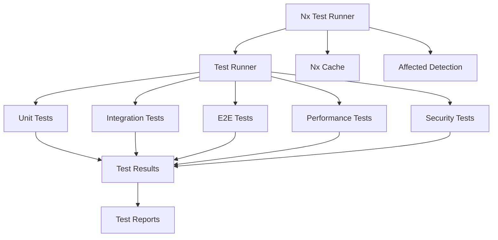

# Testing Guidelines (Vitest-First)

[](https://docs.nootropic.dev)
[](LICENSE)

## Table of Contents

- [Core Principles](#core-principles)
- [Testing Architecture](#testing-architecture)
- [Nx Testing Integration](#nx-testing-integration)
- [Types of Testing](#types-of-testing)
- [Best Practices](#best-practices)
- [Metrics](#metrics)
- [Documentation](#documentation)

## Core Principles

- **Fast Feedback**: Prioritize rapid test execution and feedback.
- **Comprehensive Coverage**: Strive for high code and scenario coverage.
- **Vitest First**: Use [Vitest](https://vitest.dev/) for all unit and integration tests.

## Testing Architecture



## Nx Testing Integration

- Use Nx to run, cache, and parallelize tests:
  - `npx nx test <project>`: Run tests for a specific project.
  - `npx nx test --all`: Run all tests.
  - `npx nx affected:test`: Run tests for affected projects.
- Vitest configuration is in `vitest.config.ts` or `vitest.config.mjs` per project.
- Coverage: `npx nx test <project> -- --coverage`.

## Types of Testing

- **Unit**: Isolate and test individual functions/classes.
- **Integration**: Test interactions between modules.
- **E2E**: Use Playwright for end-to-end flows.
- **Performance/Security**: Use Vitest plugins or custom scripts.

## Best Practices

- Use `vi.mock` and `vi.fn` for mocking.
- Prefer `describe`, `it`, and `expect` from Vitest.
- Keep tests deterministic and fast.
- Avoid global state between tests.
- Use Nx caching for efficient CI.

## Metrics

- Track code coverage and test pass rates in CI.
- Use Vitest's built-in coverage reporters.

## Documentation

- Document test structure and coverage in code and READMEs.
- Keep this guide up to date with any changes to the test strategy.

## Testing Types

### 1. Unit Testing

- Use Vitest for unit tests
- Place unit tests in `*.spec.ts` or `*.test.ts` files next to the code they test
- Follow the AAA pattern (Arrange, Act, Assert)
- Use test doubles (mocks, stubs, spies) when needed
- Keep tests focused and isolated

Example:
```typescript
import { describe, it, expect } from 'vitest';
import { MyService } from './my.service';

describe('MyService', () => {
  it('should do something', () => {
    // Arrange
    const service = new MyService();
    
    // Act
    const result = service.doSomething();
    
    // Assert
    expect(result).toBeDefined();
  });
});
```

### 2. Integration Testing

- Use Vitest for integration tests
- Place integration tests in `*.integration.spec.ts` files
- Test interactions between components
- Use real dependencies when possible
- Mock external services

Example:
```typescript
import { describe, it, expect } from 'vitest';
import { MyService } from './my.service';
import { Database } from './database';

describe('MyService Integration', () => {
  it('should interact with database', async () => {
    // Arrange
    const db = new Database();
    const service = new MyService(db);
    
    // Act
    const result = await service.saveData({ id: 1, name: 'test' });
    
    // Assert
    expect(result).toBeDefined();
    const saved = await db.findById(1);
    expect(saved.name).toBe('test');
  });
});
```

### 3. End-to-End Testing

- Use Playwright for E2E tests
- Place E2E tests in `e2e` directory
- Test complete user flows
- Use realistic test data
- Handle async operations properly

Example:
```typescript
import { test, expect } from '@playwright/test';

test('user can complete workflow', async ({ page }) => {
  // Navigate to app
  await page.goto('/');
  
  // Perform actions
  await page.click('button#start');
  await page.fill('input#name', 'Test User');
  await page.click('button#submit');
  
  // Verify results
  await expect(page.locator('.success-message')).toBeVisible();
});
```

### 4. Performance Testing

- Use Vitest for performance tests
- Place performance tests in `*.perf.spec.ts` files
- Measure execution time and resource usage
- Set performance budgets
- Run in CI/CD pipeline

Example:
```typescript
import { describe, it, expect } from 'vitest';
import { MyService } from './my.service';

describe('MyService Performance', () => {
  it('should process data within time limit', async () => {
    const service = new MyService();
    const start = performance.now();
    
    await service.processLargeDataset();
    
    const duration = performance.now() - start;
    expect(duration).toBeLessThan(1000); // 1 second limit
  });
});
```

### 5. Security Testing

- Use Vitest for security tests
- Place security tests in `*.security.spec.ts` files
- Test authentication and authorization
- Test input validation
- Test error handling

Example:
```typescript
import { describe, it, expect } from 'vitest';
import { AuthService } from './auth.service';

describe('AuthService Security', () => {
  it('should prevent SQL injection', async () => {
    const service = new AuthService();
    const maliciousInput = "'; DROP TABLE users; --";
    
    await expect(service.login(maliciousInput, 'password'))
      .rejects.toThrow('Invalid input');
  });
});
```

## Testing Tools

### Test Runners

- **Jest**: Local unit and integration testing
- **Playwright**: Local E2E testing
- **K6**: Local performance testing
- **OWASP ZAP**: Local security testing
- **Nx**: Test orchestration and caching

### Test Utilities

- **Local Test Data Generator**
- **Local Mock Server**
- **Local Test Environment Manager**
- **Local Test Reporter**
- **Nx Test Cache Manager**

## Testing Environment

### Setup

```bash
# Install local testing dependencies
pnpm install --save-dev jest playwright k6 zap @nx/jest @nx/playwright

# Configure local test environment
cp .env.test.example .env.test

# Configure Nx test environment
pnpm nx g @nx/jest:setup
```

### Configuration

```typescript
// jest.config.js
module.exports = {
  testEnvironment: 'node',
  setupFiles: ['./test/setup.ts'],
  testMatch: ['**/*.test.ts'],
  collectCoverage: true,
  coverageDirectory: 'coverage',
  coverageReporters: ['text', 'lcov'],
  verbose: true,
  maxWorkers: 2, // Optimize for local resources
  cache: true, // Enable Nx caching
  cacheDirectory: '.nx-cache/jest'
};
```

## Testing Workflow

1. **Local Development**
   - Write tests locally
   - Run tests with Nx affected detection
   - Fix issues locally

2. **Local Review**
   - Review test coverage
   - Review test quality
   - Review Nx test cache efficiency

3. **Local CI**
   - Run affected tests
   - Generate coverage reports
   - Cache test results

## Testing Metrics

1. **Coverage Metrics**
   - Line coverage
   - Branch coverage
   - Function coverage
   - Statement coverage

2. **Performance Metrics**
   - Test execution time
   - Test suite size
   - Test maintenance effort
   - Test reliability

3. **Quality Metrics**
   - Test failure rate
   - Test flakiness
   - Test complexity
   - Test documentation

## Testing Documentation

1. **Test Documentation**
   - Document test setup requirements
   - Document test data requirements
   - Document test environment setup
   - Document test execution instructions

2. **Test Reports**
   - Generate test execution reports
   - Generate coverage reports
   - Generate performance reports
   - Generate security reports

3. **Test Maintenance**
   - Document test maintenance procedures
   - Document test troubleshooting
   - Document test best practices
   - Document test tools and utilities

> **See Also**: [Testing Tutorial](../TUTORIALS/tutorial_testing.md) for detailed testing examples. 