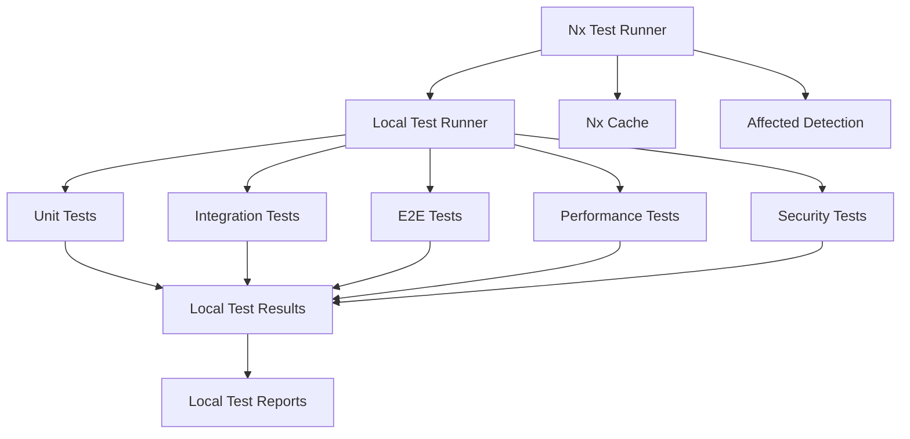

# Local Testing Guidelines

[](https://docs.nootropic.dev)
[](LICENSE)

## Table of Contents

- [Local Testing Overview](#local-testing-overview)
- [Nx Testing Integration](#nx-testing-integration)
  - [Nx Test Configuration](#nx-test-configuration)
  - [Nx Test Execution](#nx-test-execution)
  - [Nx Test Caching](#nx-test-caching)
  - [Nx Test Parallelization](#nx-test-parallelization)
  - [Nx Test Coverage](#nx-test-coverage)
  - [Nx Test Reporting](#nx-test-reporting)
  - [Nx Test Affected](#nx-test-affected)
  - [Nx Test Performance](#nx-test-performance)
  - [Nx Test Debugging](#nx-test-debugging)
  - [Nx Test Maintenance](#nx-test-maintenance)
- [Local Testing Types](#local-testing-types)
  - [Local Unit Testing](#1-local-unit-testing)
  - [Local Integration Testing](#2-local-integration-testing)
  - [Local End-to-End Testing](#3-local-end-to-end-testing)
  - [Local Performance Testing](#4-local-performance-testing)
  - [Local Security Testing](#5-local-security-testing)
- [Local Testing Tools](#local-testing-tools)
- [Local Testing Environment](#local-testing-environment)
- [Local Testing Workflow](#local-testing-workflow)
- [Local Testing Best Practices](#local-testing-best-practices)
- [Local Testing Metrics](#local-testing-metrics)
- [Local Testing Documentation](#local-testing-documentation)

## Local Testing Overview

### Core Principles

- **Local-First Testing**: All tests run locally without external dependencies
- **Privacy-Preserving**: Test data remains local and is not shared
- **Resource-Aware**: Tests optimize local resource usage
- **Reproducible**: Tests are deterministic and reproducible
- **Fast Feedback**: Quick test execution for rapid development
- **Nx Integration**: Efficient test execution with Nx caching and affected detection

### Local Testing Architecture



## Nx Testing Integration

### Nx Test Configuration

```json
// nx.json
{
  "targetDefaults": {
    "test": {
      "inputs": [
        "default",
        "^production",
        "{workspaceRoot}/jest.config.ts"
      ],
      "dependsOn": ["^build"],
      "cache": true,
      "parallel": 3,
      "maxParallel": 5,
      "outputs": ["{workspaceRoot}/coverage/{projectRoot}"],
      "options": {
        "passWithNoTests": true,
        "coverageReporters": ["text", "lcov", "html"],
        "coverageDirectory": "coverage",
        "testTimeout": 30000,
        "maxWorkers": 2
      }
    }
  },
  "plugins": [
    {
      "plugin": "@nx/jest/plugin",
      "options": {
        "testTarget": "test",
        "coverageTarget": "test:coverage"
      }
    }
  ]
}
```

### Nx Test Execution

```bash
# Run all tests with Nx
pnpm nx run-many --target=test --all

# Run affected tests
pnpm nx affected:test

# Run tests for specific projects
pnpm nx test <project-name>

# Run tests in parallel
pnpm nx run-many --target=test --all --parallel=3

# Run tests with coverage
pnpm nx test <project-name> --coverage

# Run tests with watch mode
pnpm nx test <project-name> --watch

# Run tests with specific configuration
pnpm nx test <project-name> --config=jest.config.ci.ts

# Run tests with specific test pattern
pnpm nx test <project-name> --testPathPattern=unit

# Run tests with specific test file
pnpm nx test <project-name> --testFile=my-test.spec.ts

# Run tests with debug mode
pnpm nx test <project-name> --debug

# Run tests with verbose output
pnpm nx test <project-name> --verbose

# Run tests with specific environment
pnpm nx test <project-name> --env=node

# Run tests with specific test suite
pnpm nx test <project-name> --testNamePattern="my test suite"
```

### Nx Test Caching

```json
// project.json
{
  "targets": {
    "test": {
      "executor": "@nx/jest:jest",
      "outputs": ["{workspaceRoot}/coverage/{projectRoot}"],
      "options": {
        "jestConfig": "libs/my-lib/jest.config.ts",
        "passWithNoTests": true,
        "coverageReporters": ["text", "lcov", "html"],
        "coverageDirectory": "coverage",
        "cache": true,
        "cacheDirectory": ".nx-cache/jest",
        "maxWorkers": 2
      },
      "configurations": {
        "ci": {
          "ci": true,
          "codeCoverage": true,
          "maxWorkers": 2
        },
        "debug": {
          "verbose": true,
          "maxWorkers": 1
        }
      }
    }
  }
}
```

### Nx Test Parallelization

```json
// nx.json
{
  "targetDefaults": {
    "test": {
      "parallel": 3,
      "maxParallel": 5,
      "options": {
        "maxWorkers": 2,
        "runInBand": false
      }
    }
  }
}
```

### Nx Test Coverage

```json
// project.json
{
  "targets": {
    "test:coverage": {
      "executor": "@nx/jest:jest",
      "outputs": ["{workspaceRoot}/coverage/{projectRoot}"],
      "options": {
        "jestConfig": "libs/my-lib/jest.config.ts",
        "passWithNoTests": true,
        "coverageReporters": ["text", "lcov", "html"],
        "coverageDirectory": "coverage",
        "collectCoverage": true,
        "coverageThreshold": {
          "global": {
            "branches": 80,
            "functions": 80,
            "lines": 80,
            "statements": 80
          }
        }
      }
    }
  }
}
```

### Nx Test Reporting

```json
// project.json
{
  "targets": {
    "test:report": {
      "executor": "@nx/jest:jest",
      "outputs": ["{workspaceRoot}/reports/{projectRoot}"],
      "options": {
        "jestConfig": "libs/my-lib/jest.config.ts",
        "passWithNoTests": true,
        "reporters": [
          "default",
          ["jest-junit", {
            "outputDirectory": "reports/junit",
            "outputName": "junit.xml",
            "ancestorSeparator": " › ",
            "uniqueOutputName": "false",
            "suiteNameTemplate": "{filepath}",
            "classNameTemplate": "{classname}",
            "titleTemplate": "{title}"
          }]
        ]
      }
    }
  }
}
```

### Nx Test Affected

```json
// nx.json
{
  "targetDefaults": {
    "test": {
      "inputs": [
        "default",
        "^production",
        "{workspaceRoot}/jest.config.ts"
      ],
      "dependsOn": ["^build"],
      "cache": true
    }
  }
}
```

### Nx Test Performance

```json
// project.json
{
  "targets": {
    "test:performance": {
      "executor": "@nx/jest:jest",
      "outputs": ["{workspaceRoot}/reports/performance/{projectRoot}"],
      "options": {
        "jestConfig": "libs/my-lib/jest.config.ts",
        "passWithNoTests": true,
        "reporters": [
          "default",
          ["jest-performance-reporter", {
            "outputDirectory": "reports/performance",
            "outputName": "performance.json"
          }]
        ]
      }
    }
  }
}
```

### Nx Test Debugging

```json
// project.json
{
  "targets": {
    "test:debug": {
      "executor": "@nx/jest:jest",
      "options": {
        "jestConfig": "libs/my-lib/jest.config.ts",
        "passWithNoTests": true,
        "verbose": true,
        "maxWorkers": 1,
        "runInBand": true,
        "detectOpenHandles": true,
        "forceExit": true
      }
    }
  }
}
```

### Nx Test Maintenance

```json
// project.json
{
  "targets": {
    "test:maintenance": {
      "executor": "@nx/jest:jest",
      "options": {
        "jestConfig": "libs/my-lib/jest.config.ts",
        "passWithNoTests": true,
        "updateSnapshot": true,
        "clearCache": true,
        "resetMocks": true,
        "restoreMocks": true
      }
    }
  }
}
```

## Local Testing Types

### 1. Local Unit Testing

#### Agent Testing with Nx

```typescript
// Example of local agent testing with Nx
describe('LocalAgent', () => {
  it('should process local data correctly', async () => {
    const agent = new LocalAgent();
    const result = await agent.process(localTestData);
    expect(result).toMatchLocalExpectations();
  });

  it('should handle local errors gracefully', async () => {
    const agent = new LocalAgent();
    await expect(agent.process(invalidLocalData))
      .rejects
      .toThrow(LocalError);
  });
});

// nx.json configuration for agent tests
{
  "targetDefaults": {
    "test": {
      "inputs": [
        "default",
        "^production",
        "{workspaceRoot}/jest.config.ts"
      ],
      "dependsOn": ["^build"],
      "cache": true
    }
  }
}
```

#### Model Testing with Nx

```typescript
// Example of local model testing with Nx
describe('LocalModel', () => {
  it('should make local predictions', async () => {
    const model = new LocalModel();
    const prediction = await model.predict(localInput);
    expect(prediction).toBeValidLocalPrediction();
  });

  it('should respect local resource limits', async () => {
    const model = new LocalModel();
    const resourceUsage = await model.getResourceUsage();
    expect(resourceUsage).toBeWithinLocalLimits();
  });
});

// project.json configuration for model tests
{
  "targets": {
    "test": {
      "executor": "@nx/jest:jest",
      "outputs": ["{workspaceRoot}/coverage/{projectRoot}"],
      "options": {
        "jestConfig": "libs/model/jest.config.ts",
        "passWithNoTests": true,
        "coverageReporters": ["text", "lcov"],
        "coverageDirectory": "coverage"
      }
    }
  }
}
```

### 2. Local Integration Testing

#### Workflow Testing with Nx

```typescript
// Example of local workflow testing with Nx
describe('LocalWorkflow', () => {
  it('should execute local workflow steps', async () => {
    const workflow = new LocalWorkflow();
    const result = await workflow.execute(localSteps);
    expect(result).toMatchLocalWorkflowExpectations();
  });

  it('should maintain local data consistency', async () => {
    const workflow = new LocalWorkflow();
    await workflow.execute(localSteps);
    expect(workflow.getLocalState()).toBeConsistent();
  });
});

// nx.json configuration for workflow tests
{
  "targetDefaults": {
    "test": {
      "inputs": [
        "default",
        "^production",
        "{workspaceRoot}/jest.config.ts"
      ],
      "dependsOn": ["^build"],
      "cache": true
    }
  }
}
```

### 3. Local End-to-End Testing

#### User Flow Testing with Nx

```typescript
// Example of local user flow testing with Nx
describe('LocalUserFlow', () => {
  it('should complete local user journey', async () => {
    const flow = new LocalUserFlow();
    const result = await flow.execute(localUserJourney);
    expect(result).toMatchLocalUserExpectations();
  });

  it('should handle local user errors', async () => {
    const flow = new LocalUserFlow();
    await expect(flow.execute(invalidLocalJourney))
      .rejects
      .toThrow(LocalUserError);
  });
});

// project.json configuration for E2E tests
{
  "targets": {
    "e2e": {
      "executor": "@nx/playwright:playwright",
      "outputs": ["{workspaceRoot}/dist/.playwright"],
      "options": {
        "config": "apps/my-app/playwright.config.ts",
        "headed": false
      }
    }
  }
}
```

### 4. Local Performance Testing

#### Resource Testing

```typescript
// Example of local performance testing
describe('LocalPerformance', () => {
  it('should meet local performance targets', async () => {
    const performance = new LocalPerformance();
    const metrics = await performance.measure(localOperation);
    expect(metrics).toMeetLocalTargets();
  });

  it('should optimize local resource usage', async () => {
    const performance = new LocalPerformance();
    const optimization = await performance.optimize(localResources);
    expect(optimization).toImproveLocalEfficiency();
  });
});
```

### 5. Local Security Testing

#### Privacy Testing

```typescript
// Example of local security testing
describe('LocalSecurity', () => {
  it('should protect local data', async () => {
    const security = new LocalSecurity();
    const protection = await security.verify(localData);
    expect(protection).toMeetLocalSecurityStandards();
  });

  it('should prevent local data leaks', async () => {
    const security = new LocalSecurity();
    await expect(security.handleSensitiveData(invalidLocalData))
      .rejects
      .toThrow(LocalSecurityError);
  });
});
```

## Local Testing Tools

### Test Runners

- **Jest**: Local unit and integration testing
- **Playwright**: Local E2E testing
- **K6**: Local performance testing
- **OWASP ZAP**: Local security testing
- **Nx**: Test orchestration and caching

### Test Utilities

- **Local Test Data Generator**
- **Local Mock Server**
- **Local Test Environment Manager**
- **Local Test Reporter**
- **Nx Test Cache Manager**

## Local Testing Environment

### Setup

```bash
# Install local testing dependencies
pnpm install --save-dev jest playwright k6 zap @nx/jest @nx/playwright

# Configure local test environment
cp .env.test.example .env.test

# Configure Nx test environment
pnpm nx g @nx/jest:setup
```

### Configuration

```typescript
// jest.config.js
module.exports = {
  testEnvironment: 'node',
  setupFiles: ['./test/setup.ts'],
  testMatch: ['**/*.test.ts'],
  collectCoverage: true,
  coverageDirectory: 'coverage',
  coverageReporters: ['text', 'lcov'],
  verbose: true,
  maxWorkers: 2, // Optimize for local resources
  cache: true, // Enable Nx caching
  cacheDirectory: '.nx-cache/jest'
};
```

## Local Testing Workflow

1. **Local Development**
   - Write tests locally
   - Run tests with Nx affected detection
   - Fix issues locally

2. **Local Review**
   - Review test coverage
   - Review test quality
   - Review Nx test cache efficiency

3. **Local CI**
   - Run affected tests
   - Generate coverage reports
   - Cache test results

## Local Testing Best Practices

1. **Test Organization**
   - Group tests by feature
   - Use descriptive test names
   - Follow AAA pattern (Arrange, Act, Assert)
   - Keep tests independent
   - Use appropriate test types

2. **Test Performance**
   - Use Nx caching effectively
   - Run tests in parallel when possible
   - Optimize test execution time
   - Monitor test performance
   - Clean up test resources

3. **Test Maintenance**
   - Keep tests up to date
   - Remove obsolete tests
   - Update test data
   - Maintain test documentation
   - Review test coverage

4. **Test Quality**
   - Write meaningful assertions
   - Test edge cases
   - Handle errors properly
   - Use appropriate mocks
   - Follow testing best practices

## Local Testing Metrics

1. **Test Coverage**
   - Line coverage
   - Branch coverage
   - Function coverage
   - Statement coverage

2. **Test Performance**
   - Test execution time
   - Test parallelization
   - Cache hit rate
   - Resource usage

3. **Test Quality**
   - Test reliability
   - Test maintainability
   - Test readability
   - Test documentation

## Local Testing Documentation

1. **Test Documentation**
   - Test purpose
   - Test setup
   - Test data
   - Test results
   - Test maintenance

2. **Test Reports**
   - Test coverage reports
   - Test performance reports
   - Test quality reports
   - Test maintenance reports

> **See Also**: [Testing Tutorial](../TUTORIALS/tutorial_testing.md) for detailed testing examples. 