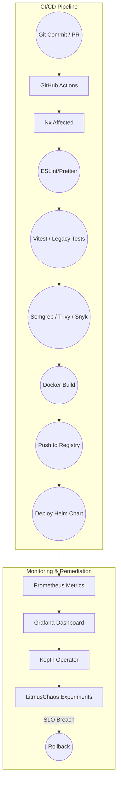

# Self-Healing CI/CD Pipeline

## Overview

The Self-Healing CI/CD Pipeline is a robust, automated system that ensures code quality, security, and reliability through continuous integration, testing, and deployment. It incorporates self-healing capabilities through Keptn and LitmusChaos for automated remediation and chaos testing, with a focus on local development and testing. The pipeline leverages Nx for efficient build caching, affected project detection, and parallel execution.

## Architecture



## Pipeline Stages

### 1. Code Quality

#### Nx Affected Detection
```yaml
# .github/workflows/ci.yml
name: CI
on: [push, pull_request]
jobs:
  affected:
    runs-on: ubuntu-latest
    steps:
      - uses: actions/checkout@v3
      - uses: actions/setup-node@v3
        with:
          node-version: '20'
      - run: pnpm install
      - name: Get affected projects
        id: affected
        run: |
          AFFECTED_APPS=$(pnpm nx affected:apps --plain)
          AFFECTED_LIBS=$(pnpm nx affected:libs --plain)
          echo "affected_apps=$AFFECTED_APPS" >> $GITHUB_OUTPUT
          echo "affected_libs=$AFFECTED_LIBS" >> $GITHUB_OUTPUT
      - name: Run affected tests
        if: steps.affected.outputs.affected_apps != ''
        run: pnpm nx affected:test --parallel=3
      - name: Run affected lint
        if: steps.affected.outputs.affected_apps != ''
        run: pnpm nx affected:lint --parallel=3
      - name: Run affected build
        if: steps.affected.outputs.affected_apps != ''
        run: pnpm nx affected:build --parallel=3
```

#### Nx Linting & Formatting
```yaml
# .github/workflows/lint.yml
name: Lint
on: [push, pull_request]
jobs:
  lint:
    runs-on: ubuntu-latest
    steps:
      - uses: actions/checkout@v3
      - uses: actions/setup-node@v3
        with:
          node-version: '20'
      - run: pnpm install
      - name: Run ESLint
        run: pnpm nx affected:lint --parallel=3
      - name: Run Prettier
        run: pnpm nx affected:format:check --parallel=3
      - name: Run TypeScript
        run: pnpm nx affected:type-check --parallel=3
```

#### Nx Unit Testing
```yaml
# .github/workflows/test.yml
name: Test
on: [push, pull_request]
jobs:
  test:
    runs-on: ubuntu-latest
    steps:
      - uses: actions/checkout@v3
      - uses: actions/setup-node@v3
        with:
          node-version: '20'
      - run: pnpm install
      - name: Run tests
        run: pnpm nx affected:test --parallel=3 --coverage
      - name: Upload coverage
        uses: codecov/codecov-action@v3
        with:
          token: ${{ secrets.CODECOV_TOKEN }}
```

#### Nx Security Scanning
```yaml
# .github/workflows/security.yml
name: Security
on: [push, pull_request]
jobs:
  security:
    runs-on: ubuntu-latest
    steps:
      - uses: actions/checkout@v3
      - uses: actions/setup-node@v3
        with:
          node-version: '20'
      - run: pnpm install
      - name: Run Semgrep
        run: pnpm nx affected:security:semgrep --parallel=3
      - name: Run Trivy
        run: pnpm nx affected:security:trivy --parallel=3
      - name: Run Snyk
        run: pnpm nx affected:security:snyk --parallel=3
```

### 2. Build & Package

#### Nx Build Configuration
```yaml
# .github/workflows/build.yml
name: Build
on: [push, pull_request]
jobs:
  build:
    runs-on: ubuntu-latest
    steps:
      - uses: actions/checkout@v3
      - uses: actions/setup-node@v3
        with:
          node-version: '20'
      - run: pnpm install
      - name: Build affected projects
        run: pnpm nx affected:build --parallel=3
      - name: Cache Nx
        uses: actions/cache@v3
        with:
          path: .nx-cache
          key: ${{ runner.os }}-nx-${{ hashFiles('**/nx.json') }}
          restore-keys: |
            ${{ runner.os }}-nx-
```

#### Nx Docker Build
```yaml
# .github/workflows/docker.yml
name: Docker
on: [push, pull_request]
jobs:
  docker:
    runs-on: ubuntu-latest
    steps:
      - uses: actions/checkout@v3
      - uses: actions/setup-node@v3
        with:
          node-version: '20'
      - run: pnpm install
      - name: Build Docker images
        run: pnpm nx affected:docker:build --parallel=3
      - name: Push Docker images
        run: pnpm nx affected:docker:push --parallel=3
```

### 3. Deployment

#### Nx Deployment Strategy
```yaml
# .github/workflows/deploy.yml
name: Deploy
on: [push]
jobs:
  deploy:
    runs-on: ubuntu-latest
    steps:
      - uses: actions/checkout@v3
      - uses: actions/setup-node@v3
        with:
          node-version: '20'
      - run: pnpm install
      - name: Deploy affected projects
        run: pnpm nx affected:deploy --parallel=2
      - name: Verify deployment
        run: pnpm nx affected:verify --parallel=2
```

#### Nx Helm Deployment
```yaml
# .github/workflows/helm.yml
name: Helm
on: [push]
jobs:
  helm:
    runs-on: ubuntu-latest
    steps:
      - uses: actions/checkout@v3
      - uses: actions/setup-node@v3
        with:
          node-version: '20'
      - run: pnpm install
      - name: Deploy Helm charts
        run: pnpm nx affected:helm:deploy --parallel=2
      - name: Verify Helm deployment
        run: pnpm nx affected:helm:verify --parallel=2
```

## Self-Healing Components

### 1. Keptn Integration

#### Nx Service Level Objectives
```yaml
apiVersion: keptn.sh/v1alpha3
kind: ServiceLevelObjective
metadata:
  name: nx-build-performance
spec:
  target: 300s
  window: 5m
  indicators:
    - name: nx_build_duration
      query: histogram_quantile(0.95, rate(nx_build_duration_seconds_bucket[5m]))
    - name: nx_cache_hit_ratio
      query: rate(nx_cache_hits_total[5m]) / rate(nx_cache_operations_total[5m])
    - name: nx_test_coverage
      query: avg(nx_test_coverage{project=~".*"})
```

#### Nx Remediation Actions
```yaml
apiVersion: keptn.sh/v1alpha3
kind: Remediation
metadata:
  name: nx-slow-build
spec:
  triggers:
    - condition: nx_build_duration > 300s
  actions:
    - name: clear-cache
      action: pnpm nx reset
    - name: parallel-build
      action: pnpm nx affected:build --parallel=4
    - name: optimize-cache
      action: pnpm nx optimize:cache
```

### 2. LitmusChaos Experiments

#### Nx Build Chaos Scenarios
```yaml
apiVersion: litmuschaos.io/v1alpha1
kind: ChaosExperiment
metadata:
  name: nx-cache-corruption
spec:
  definition:
    scope: cluster
    permissions:
      - apiGroups: [""]
        resources: ["pods"]
        verbs: ["get", "list", "delete"]
    steps:
      - name: corrupt-cache
        action: delete
        target: .nx-cache
      - name: verify-recovery
        action: verify
        target: nx-cache-recovery
```

#### Nx Recovery Procedures
```yaml
apiVersion: litmuschaos.io/v1alpha1
kind: ChaosEngine
metadata:
  name: nx-cache-recovery
spec:
  engineState: active
  experiments:
    - name: nx-cache-corruption
      spec:
        components:
          runner:
            image: litmuschaos/chaos-runner:latest
          monitor:
            image: litmuschaos/chaos-exporter:latest
        recovery:
          - name: rebuild-cache
            action: pnpm nx reset
          - name: verify-cache
            action: pnpm nx verify:cache
```

## Monitoring & Metrics

### 1. Prometheus Metrics

#### Nx Pipeline Metrics
```yaml
- name: nx_build_duration_seconds
  type: histogram
  help: "Duration of Nx build operations"
  labels:
    - project
    - cache_status
    - environment
    - parallel_jobs

- name: nx_cache_hit_ratio
  type: gauge
  help: "Nx cache hit ratio"
  labels:
    - operation
    - project
    - environment
    - cache_type

- name: nx_test_coverage
  type: gauge
  help: "Test coverage for Nx projects"
  labels:
    - project
    - environment
    - test_type
    - coverage_type

- name: nx_deployment_duration_seconds
  type: histogram
  help: "Duration of Nx deployment operations"
  labels:
    - project
    - environment
    - deployment_type
```

### 2. Grafana Dashboards

#### Nx Pipeline Overview
- Build status and duration
- Cache hit rates
- Test results and coverage
- Security scan results
- Deployment status
- Local development metrics
- Parallel execution metrics
- Resource usage metrics

#### Nx SLO Monitoring
- Build performance
- Test coverage
- Resource usage
- SLO violations
- Local performance metrics
- Cache efficiency
- Parallel efficiency
- Deployment efficiency

## Error Handling

### 1. Pipeline Failures

#### Nx Retry Strategy
```yaml
retry:
  maxAttempts: 3
  backoff:
    initialDelay: 30s
    maxDelay: 5m
    factor: 2
  localFirst: true
  nx:
    cache: true
    parallel: 2
    affected: true
    optimization: true
```

#### Nx Failure Notifications
```yaml
notifications:
  slack:
    channel: "#ci-alerts"
  nx:
    cache: true
    affected: true
    optimization: true
    performance: true
```

### 2. Cache Management

#### Nx Cache Recovery
```yaml
cache:
  recovery:
    enabled: true
    strategy: incremental
    maxAge: 7d
    nx:
      local: true
      distributed: false
      optimization: true
      verification: true
```

#### Nx Cache Validation
```yaml
validation:
  checksum: true
  integrity: true
  nx:
    verify: true
    repair: true
    optimize: true
    monitor: true
```

## Testing

### 1. Pipeline Tests

```typescript
describe('CI/CD Pipeline', () => {
  it('should pass Nx linting', async () => {
    // Test implementation
  });
  
  it('should run Nx unit tests', async () => {
    // Test implementation
  });
  
  it('should perform Nx security scan', async () => {
    // Test implementation
  });

  it('should run Nx local tests', async () => {
    // Test implementation
  });

  it('should optimize Nx cache', async () => {
    // Test implementation
  });

  it('should handle Nx parallel execution', async () => {
    // Test implementation
  });
});
```

### 2. Self-Healing Tests

```typescript
describe('Self-Healing', () => {
  it('should detect Nx SLO violations', async () => {
    // Test implementation
  });
  
  it('should execute Nx remediation', async () => {
    // Test implementation
  });
  
  it('should perform Nx rollback', async () => {
    // Test implementation
  });

  it('should handle Nx local failures', async () => {
    // Test implementation
  });

  it('should optimize Nx cache', async () => {
    // Test implementation
  });

  it('should verify Nx deployment', async () => {
    // Test implementation
  });
});
```

## Usage Examples

### 1. Pipeline Configuration

```yaml
name: CI/CD Pipeline
on:
  push:
    branches: [main]
  pull_request:
    branches: [main]

jobs:
  build:
    runs-on: ubuntu-latest
    steps:
      - uses: actions/checkout@v2
      - name: Nx Lint
        run: pnpm nx affected:lint --parallel=3
      - name: Nx Test
        run: pnpm nx affected:test --parallel=3
      - name: Nx Security Scan
        run: pnpm nx affected:security --parallel=3
      - name: Nx Build
        run: pnpm nx affected:build --parallel=3
      - name: Nx Deploy
        run: pnpm nx affected:deploy --parallel=2
      - name: Nx Local Test
        run: pnpm nx affected:test:local --parallel=3
```

### 2. Self-Healing Configuration

```yaml
apiVersion: keptn.sh/v1alpha3
kind: ServiceLevelObjective
metadata:
  name: nx-availability
spec:
  target: 0.999
  window: 1h
  indicators:
    - name: nx_uptime
      query: sum(rate(nx_operations_total[5m])) / sum(rate(nx_operations_total[5m]))
    - name: nx_local_uptime
      query: sum(rate(nx_local_operations_total[5m])) / sum(rate(nx_local_operations_total[5m]))
    - name: nx_cache_efficiency
      query: rate(nx_cache_hits_total[5m]) / rate(nx_cache_operations_total[5m])
    - name: nx_parallel_efficiency
      query: sum(nx_parallel_jobs_completed_total[5m]) / sum(nx_parallel_jobs_total[5m])

---
apiVersion: litmuschaos.io/v1alpha1
kind: ChaosEngine
metadata:
  name: nx-availability-test
spec:
  engineState: active
  experiments:
    - name: nx-cache-corruption
      spec:
        components:
          runner:
            image: litmuschaos/chaos-runner:latest
    - name: nx-local-failure
      spec:
        components:
          runner:
            image: litmuschaos/chaos-runner:latest
    - name: nx-parallel-failure
      spec:
        components:
          runner:
            image: litmuschaos/chaos-runner:latest
```
