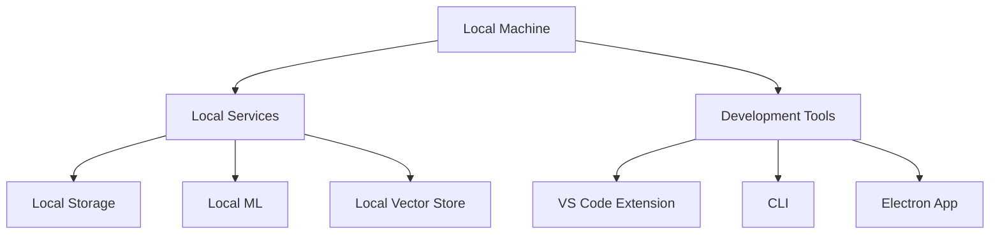

# Local Development Guide

[](https://docs.nootropic.dev)
[](LICENSE)

> **NOTE**: The canonical source for the technology and tool stack is `docs/TOOLCHAIN.md`. This document provides local development guidance.

This document provides comprehensive guidance for setting up and running the nootropic platform in a local development environment.

## Table of Contents

- [Architecture Overview](#architecture-overview)
- [Local Setup](#local-setup)
- [Resource Management](#resource-management)
- [Local Services](#local-services)
- [Development Tools](#development-tools)
- [Configuration Management](#configuration-management)
- [Performance Optimization](#performance-optimization)
- [Monitoring](#monitoring)
- [Troubleshooting](#troubleshooting)
- [Backup & Restore](#backup--restore)
- [Security](#security)
- [Compliance](#compliance)
- [Nx Deployment](#nx-deployment)

## Architecture Overview

### Local Environment



> **See Also**: [Architecture Overview](../ARCHITECTURE.md#introduction--goals) for detailed architecture documentation.

## Local Setup

### Prerequisites

- **Docker** (v20.10+)

  ```bash
  # Verify Docker installation
  docker --version
  docker-compose --version
  ```

- **Node.js** (v18.17.0+)

  ```bash
  # Install via nvm
  nvm install 18.17.0
  nvm use 18.17.0
  ```

- **pnpm** (v9.0.0+)

  ```bash
  # Install pnpm
  npm install -g pnpm@9.0.0

  # Verify installation
  pnpm --version
  ```

- **Nx CLI** (v21.1.2)

  ```bash
  # Install Nx CLI
  pnpm add -g nx@21.1.2

  # Verify installation
  nx --version
  ```

> **See Also**: [Development Tools](../TECH_STACK.md#development--build-tools) for development environment setup.

### Nx Workspace Setup

1. **Initialize Workspace**

   ```bash
   # Create new workspace
   pnpm dlx create-nx-workspace@latest nootropic --preset=ts

   # Or use existing workspace
   pnpm install
   ```

2. **Configure Local Build**

   ```bash
   # Configure build system
   pnpm nx g @nx/workspace:setup-build-system

   # Configure test system
   pnpm nx g @nx/workspace:setup-test-system

   # Configure local development
   pnpm nx g @nx/workspace:setup-local-dev
   ```

3. **Project Configuration**

   ```json
   {
     "targetDefaults": {
       "build": {
         "dependsOn": ["^build"],
         "inputs": ["production", "^production"],
         "outputs": ["{projectRoot}/dist"],
         "cache": true,
         "parallel": 3
       },
       "test": {
         "dependsOn": ["^build"],
         "inputs": ["default", "^default"],
         "cache": true,
         "parallel": 3
       },
       "serve": {
         "dependsOn": ["build"],
         "inputs": ["production", "^production"],
         "cache": true
       }
     }
   }
   ```

> **See Also**: [Nx Guide](../NX_GUIDE.md) for Nx workspace configuration.

## Resource Management

### Memory Management

1. **Memory Limits**

   ```bash
   # Set memory limit
   pnpm nx config:set memory.limit=4GB

   # Monitor memory usage
   pnpm nx monitor:memory
   ```

2. **Memory Optimization**

   ```bash
   # Optimize memory usage
   pnpm nx optimize:memory

   # Clean memory cache
   pnpm nx clean:memory
   ```

### CPU Management

1. **CPU Limits**

   ```bash
   # Set CPU limit
   pnpm nx config:set cpu.limit=4

   # Monitor CPU usage
   pnpm nx monitor:cpu
   ```

2. **CPU Optimization**

   ```bash
   # Optimize CPU usage
   pnpm nx optimize:cpu

   # Clean CPU cache
   pnpm nx clean:cpu
   ```

### Storage Management

1. **Storage Limits**

   ```bash
   # Set storage limit
   pnpm nx config:set storage.limit=10GB

   # Monitor storage usage
   pnpm nx monitor:storage
   ```

2. **Storage Optimization**

   ```bash
   # Optimize storage usage
   pnpm nx optimize:storage

   # Clean storage cache
   pnpm nx clean:storage
   ```

## Local Services

### Local Storage

1. **Setup Local Storage**

   ```bash
   # Start local storage
   pnpm nx serve local-storage

   # Configure storage
   pnpm nx config:storage
   ```

2. **Storage Management**

   ```bash
   # Monitor storage
   pnpm nx monitor:storage

   # Backup storage
   pnpm nx backup:storage

   # Restore storage
   pnpm nx restore:storage
   ```

### Local ML

1. **Setup Local ML**

   ```bash
   # Start local ML
   pnpm nx serve local-ml

   # Configure ML
   pnpm nx config:ml
   ```

2. **ML Management**

   ```bash
   # Monitor ML
   pnpm nx monitor:ml

   # Optimize ML
   pnpm nx optimize:ml
   ```

### Local Vector Store

1. **Setup Vector Store**

   ```bash
   # Start vector store
   pnpm nx serve vector-store

   # Configure vector store
   pnpm nx config:vector-store
   ```

2. **Vector Store Management**

   ```bash
   # Monitor vector store
   pnpm nx monitor:vector-store

   # Optimize vector store
   pnpm nx optimize:vector-store
   ```

## Development Tools

### CLI Development

1. **CLI Setup**

   ```bash
   # Start CLI in watch mode
   pnpm nx serve nootropic-cli

   # Run tests
   pnpm nx test nootropic-cli

   # Build CLI
   pnpm nx build nootropic-cli
   ```

2. **CLI Management**

   ```bash
   # Monitor CLI
   pnpm nx monitor:cli

   # Optimize CLI
   pnpm nx optimize:cli
   ```

### VS Code Extension

1. **Extension Setup**

   ```bash
   # Start extension host
   pnpm nx serve nootropic-vscode-ext

   # Run tests
   pnpm nx test nootropic-vscode-ext

   # Build extension
   pnpm nx build nootropic-vscode-ext
   ```

2. **Extension Management**

   ```bash
   # Monitor extension
   pnpm nx monitor:vscode-ext

   # Optimize extension
   pnpm nx optimize:vscode-ext
   ```

### Electron App

1. **App Setup**

   ```bash
   # Start app in development
   pnpm nx serve nootropic-electron

   # Run tests
   pnpm nx test nootropic-electron

   # Build app
   pnpm nx build nootropic-electron
   ```

2. **App Management**

   ```bash
   # Monitor app
   pnpm nx monitor:electron

   # Optimize app
   pnpm nx optimize:electron
   ```

## Configuration Management

### Local Configuration

1. **Environment Setup**

   ```bash
   # Setup environment
   pnpm nx setup:env

   # Configure environment
   pnpm nx config:env
   ```

2. **Resource Configuration**

   ```bash
   # Configure resources
   pnpm nx config:resources

   # Configure performance
   pnpm nx config:performance
   ```

### Security Configuration

1. **Local Security**

   ```bash
   # Setup security
   pnpm nx setup:security

   # Configure security
   pnpm nx config:security
   ```

2. **Access Control**

   ```bash
   # Setup access control
   pnpm nx setup:access

   # Configure access control
   pnpm nx config:access
   ```

## Performance Optimization

### Build Optimization

1. **Build Performance**

   ```bash
   # Optimize build
   pnpm nx optimize:build

   # Analyze build
   pnpm nx analyze:build
   ```

2. **Test Performance**

   ```bash
   # Optimize tests
   pnpm nx optimize:test

   # Analyze tests
   pnpm nx analyze:test
   ```

### Runtime Optimization

1. **Runtime Performance**

   ```bash
   # Optimize runtime
   pnpm nx optimize:runtime

   # Analyze runtime
   pnpm nx analyze:runtime
   ```

2. **Resource Optimization**

   ```bash
   # Optimize resources
   pnpm nx optimize:resources

   # Analyze resources
   pnpm nx analyze:resources
   ```

## Monitoring

### System Monitoring

1. **Resource Monitoring**

   ```bash
   # Monitor system
   pnpm nx monitor:system

   # Monitor resources
   pnpm nx monitor:resources
   ```

2. **Performance Monitoring**

   ```bash
   # Monitor performance
   pnpm nx monitor:performance

   # Monitor metrics
   pnpm nx monitor:metrics
   ```

### Application Monitoring

1. **App Monitoring**

   ```bash
   # Monitor app
   pnpm nx monitor:app

   # Monitor services
   pnpm nx monitor:services
   ```

2. **Error Monitoring**

   ```bash
   # Monitor errors
   pnpm nx monitor:errors

   # Monitor logs
   pnpm nx monitor:logs
   ```

## Troubleshooting

### Common Issues

1. **Resource Issues**

   ```bash
   # Check resources
   pnpm nx check:resources

   # Fix resources
   pnpm nx fix:resources
   ```

2. **Performance Issues**

   ```bash
   # Check performance
   pnpm nx check:performance

   # Fix performance
   pnpm nx fix:performance
   ```

### Error Handling

1. **Error Checking**

   ```bash
   # Check errors
   pnpm nx check:errors

   # Fix errors
   pnpm nx fix:errors
   ```

2. **Log Analysis**

   ```bash
   # Analyze logs
   pnpm nx analyze:logs

   # Fix logs
   pnpm nx fix:logs
   ```

## Backup & Restore

### Local Backup

1. **Data Backup**

   ```bash
   # Backup data
   pnpm nx backup:data

   # Backup config
   pnpm nx backup:config
   ```

2. **System Backup**

   ```bash
   # Backup system
   pnpm nx backup:system

   # Backup services
   pnpm nx backup:services
   ```

### Restore Process

1. **Data Restore**

   ```bash
   # Restore data
   pnpm nx restore:data

   # Restore config
   pnpm nx restore:config
   ```

2. **System Restore**

   ```bash
   # Restore system
   pnpm nx restore:system

   # Restore services
   pnpm nx restore:services
   ```

## Security

### Local Security

1. **Security Setup**

   ```bash
   # Setup security
   pnpm nx setup:security

   # Configure security
   pnpm nx config:security
   ```

2. **Security Management**

   ```bash
   # Monitor security
   pnpm nx monitor:security

   # Update security
   pnpm nx update:security
   ```

### Access Control

1. **Access Setup**

   ```bash
   # Setup access
   pnpm nx setup:access

   # Configure access
   pnpm nx config:access
   ```

2. **Access Management**

   ```bash
   # Monitor access
   pnpm nx monitor:access

   # Update access
   pnpm nx update:access
   ```

## Compliance

### Local Compliance

1. **Compliance Setup**

   ```bash
   # Setup compliance
   pnpm nx setup:compliance

   # Configure compliance
   pnpm nx config:compliance
   ```

2. **Compliance Management**

   ```bash
   # Monitor compliance
   pnpm nx monitor:compliance

   # Update compliance
   pnpm nx update:compliance
   ```

### Documentation

1. **Documentation Setup**

   ```bash
   # Setup documentation
   pnpm nx setup:docs

   # Configure documentation
   pnpm nx config:docs
   ```

2. **Documentation Management**

   ```bash
   # Monitor documentation
   pnpm nx monitor:docs

   # Update documentation
   pnpm nx update:docs
   ```

> **See Also**: [Performance Guide](../PERFORMANCE.md) for performance details.
> **See Also**: [Monitoring Guide](../MONITORING.md) for monitoring details.
> **See Also**: [Security Guide](../SECURITY.md) for security details.

## Nx Deployment

### Nx Build System

1. **Build Configuration**

   ```json
   {
     "targetDefaults": {
       "build": {
         "dependsOn": ["^build"],
         "inputs": ["production", "^production"],
         "outputs": ["{projectRoot}/dist"],
         "cache": true,
         "parallel": 3,
         "optimization": {
           "scripts": true,
           "styles": true,
           "fonts": true,
           "images": true
         }
       }
     }
   }
   ```

2. **Build Optimization**

   ```bash
   # Optimize build configuration
   pnpm nx optimize:build-config

   # Analyze build performance
   pnpm nx analyze:build

   # Clean build cache
   pnpm nx clean:build-cache
   ```

### Nx Test System

1. **Test Configuration**

   ```json
   {
     "targetDefaults": {
       "test": {
         "dependsOn": ["^build"],
         "inputs": ["default", "^default"],
         "cache": true,
         "parallel": 3,
         "coverage": true,
         "reports": true
       }
     }
   }
   ```

2. **Test Optimization**

   ```bash
   # Optimize test configuration
   pnpm nx optimize:test-config

   # Analyze test performance
   pnpm nx analyze:test

   # Clean test cache
   pnpm nx clean:test-cache
   ```

### Nx Project Graph

1. **Graph Configuration**

   ```json
   {
     "targetDefaults": {
       "graph": {
         "dependsOn": ["^build"],
         "inputs": ["default", "^default"],
         "cache": true,
         "visualize": true,
         "analyze": true
       }
     }
   }
   ```

2. **Graph Optimization**

   ```bash
   # Optimize graph configuration
   pnpm nx optimize:graph-config

   # Analyze graph performance
   pnpm nx analyze:graph

   # Clean graph cache
   pnpm nx clean:graph-cache
   ```

### Nx Cache System

1. **Cache Configuration**

   ```json
   {
     "targetDefaults": {
       "cache": {
         "enabled": true,
         "maxSize": "10GB",
         "ttl": "7d",
         "compression": true,
         "encryption": true
       }
     }
   }
   ```

2. **Cache Optimization**

   ```bash
   # Optimize cache configuration
   pnpm nx optimize:cache-config

   # Analyze cache performance
   pnpm nx analyze:cache

   # Clean cache
   pnpm nx clean:cache
   ```

### Nx Deployment Strategies

1. **Local Deployment**

   ```bash
   # Deploy locally
   pnpm nx deploy:local

   # Deploy with cache
   pnpm nx deploy:local --cache

   # Deploy with optimization
   pnpm nx deploy:local --optimize
   ```

2. **Development Deployment**

   ```bash
   # Deploy to development
   pnpm nx deploy:dev

   # Deploy with cache
   pnpm nx deploy:dev --cache

   # Deploy with optimization
   pnpm nx deploy:dev --optimize
   ```

3. **Production Deployment**

   ```bash
   # Deploy to production
   pnpm nx deploy:prod

   # Deploy with cache
   pnpm nx deploy:prod --cache

   # Deploy with optimization
   pnpm nx deploy:prod --optimize
   ```

### Nx Deployment Monitoring

1. **Deployment Monitoring**

   ```bash
   # Monitor deployment
   pnpm nx monitor:deployment

   # Monitor deployment performance
   pnpm nx monitor:deployment-performance

   # Monitor deployment logs
   pnpm nx monitor:deployment-logs
   ```

2. **Deployment Analytics**

   ```bash
   # Analyze deployment
   pnpm nx analyze:deployment

   # Analyze deployment performance
   pnpm nx analyze:deployment-performance

   # Analyze deployment logs
   pnpm nx analyze:deployment-logs
   ```

### Nx Deployment Best Practices

1. **Build Best Practices**
   * Use incremental builds
   * Enable build caching
   * Optimize build configuration
   * Monitor build performance
   * Clean build cache regularly

2. **Test Best Practices**
   * Use parallel testing
   * Enable test caching
   * Optimize test configuration
   * Monitor test performance
   * Clean test cache regularly

3. **Graph Best Practices**
   * Use graph visualization
   * Enable graph caching
   * Optimize graph configuration
   * Monitor graph performance
   * Clean graph cache regularly

4. **Cache Best Practices**
   * Enable cache compression
   * Enable cache encryption
   * Set cache size limits
   * Set cache TTL
   * Clean cache regularly

5. **Deployment Best Practices**
   * Use deployment strategies
   * Enable deployment caching
   * Optimize deployment configuration
   * Monitor deployment performance
   * Clean deployment cache regularly
